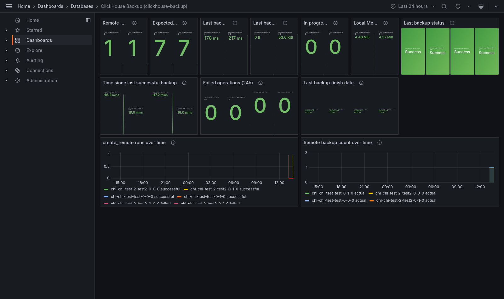

# Регулярный бэкап ClickHouse в S3 через clickhouse-backup

## Область применения

Инструкция описывает настройку регулярного резервного копирования ClickHouse-кластера `chi-test` (Altinity `clickhouse-operator`) в S3-совместимое хранилище (MinIO) с помощью [`clickhouse-backup`](https://github.com/Altinity/clickhouse-backup) — того же вендора, что и сам оператор.

Предполагается, что уже развёрнуты:
- `clickhouse-operator` и кластер `chi-test` (namespace `clickhouse`) — см. [ClickHouse + мониторинг на kind](clickhouse-monitoring-stack-on-kind.md);
- S3-совместимое хранилище (MinIO, namespace `minio`) — см. [Настройка бэкапа PostgreSQL через WAL-G](postgres-walg-backup-setup.md#1-развёртывание-minio-если-ещё-не-развёрнут), MinIO там уже поднят и переиспользуется здесь под отдельным бакетом.

Основные шаги (1–8) — на примере `chi-test`. Второй кластер (`chi-test-2`, namespace `clickhouse-2`) настроен по той же схеме и описан отдельно в разделе 11 — как проверка, что подход обобщается на несколько кластеров без правок (тот же паттерн, что уже проверялся для мониторинга в [clickhouse-monitoring-stack-on-kind.md](clickhouse-monitoring-stack-on-kind.md#несколько-кластеров-в-разных-namespace)).

## 1. Как это работает

`clickhouse-backup` (в отличие от WAL-G у Postgres) не работает по сети со своим отдельным процессом — он использует `ALTER TABLE ... FREEZE`, создающий на диске хардлинки данных партов в каталоге `shadow/`, а затем сам копирует эти файлы в S3. Из этого следует главное архитектурное требование:

> **`clickhouse-backup` обязан делить с `clickhouse-server` одну и ту же файловую систему `/var/lib/clickhouse`** — иначе он не увидит ни данные, ни созданный `FREEZE`'ом `shadow/`. Поэтому это не отдельный сервис, а sidecar-контейнер в том же поде.

Реплики кластера `test` (`chi-chi-test-test-0-0-0`, `chi-chi-test-test-0-1-0`) в этом репозитории **независимые** — без ZooKeeper/Keeper (см. [clickhouse-monitoring-stack-on-kind.md](clickhouse-monitoring-stack-on-kind.md)), то есть у каждой свои, несинхронизированные данные. Значит и бэкапить их нужно по отдельности, в разные префиксы S3, — иначе один под перезапишет бэкап другого.

## 2. Бакет в MinIO

```bash
MINIO_POD=$(kubectl get pods -n minio -l app=minio -o jsonpath='{.items[0].metadata.name}')
kubectl exec -n minio "$MINIO_POD" -- mc mb local/clickhouse-backups
```

Отдельный бакет от `postgres-backups` — просто для читаемости, ничего не мешало бы использовать общий с разными префиксами.

## 3. Секрет с доступом к S3 и паролем ClickHouse-пользователя

```bash
kubectl create secret generic clickhouse-backup-s3 \
  --namespace clickhouse \
  --from-literal=S3_ACCESS_KEY=minioadmin \
  --from-literal=S3_SECRET_KEY=minioadmin \
  --from-literal=CLICKHOUSE_PASSWORD=backup
```

`clickhouse-backup` конфигурируется полностью через переменные окружения (весь `config.yml` можно переопределить env-переменными в верхнем регистре) — секретные значения идут через `envFrom.secretRef`, остальные (не секретные) — прямо в манифесте CHI, см. шаг 5.

## 4. Отдельный ClickHouse-пользователь для бэкапа

`clickhouse-backup` делает `ALTER TABLE ... FREEZE` и читает `system.*` — нужен пользователь с непривилегированным, но не `readonly`-профилем (`readonly` в этом кластере и так уже переопределён на `2`, см. `chi-test.yaml`, но `ALTER` он всё равно не разрешает). Заводим отдельного пользователя `backup`, ограниченного localhost'ом — sidecar сидит в том же поде, что и `clickhouse-server`, поэтому подключение всегда идёт с `127.0.0.1`:

```yaml
# clickhouse/installations/chi-test.yaml, spec.configuration.users
backup/password: "backup"
backup/networks/ip:
  - "127.0.0.1"
  - "::1"
backup/profile: default
```

## 5. PVC и sidecar-контейнер

До этого момента ClickHouse в этом репозитории вообще не имел персистентного хранилища (`/var/lib/clickhouse` жил в writable-слое контейнера) — с точки зрения мониторинга это было не важно, но для бэкапа это дефолт, который придётся исправить в любом случае: без реального volume `FREEZE`-снепшоты и сам бэкап-процесс работать не будут (данные и так переживали только рестарт контейнера, не пересоздание пода).

```yaml
# clickhouse/installations/chi-test.yaml
spec:
  configuration:
    clusters:
      - name: "test"
        templates:
          podTemplate: pod-template-with-backup
          dataVolumeClaimTemplate: clickhouse-data
        layout:
          shardsCount: 1
          replicasCount: 2
  templates:
    podTemplates:
      - name: pod-template-with-backup
        spec:
          containers:
            - name: clickhouse
              image: clickhouse/clickhouse-server:latest
            - name: clickhouse-backup
              image: altinity/clickhouse-backup:stable
              command:
                - clickhouse-backup
              args:
                - server
                - --watch
                - --watch-interval=12h
                - --full-interval=24h
              ports:
                - name: backup-api
                  containerPort: 7171
              resources:
                requests:
                  cpu: 50m
                  memory: 128Mi
                limits:
                  cpu: 250m
                  memory: 512Mi
              env:
                - name: POD_NAME
                  valueFrom:
                    fieldRef:
                      fieldPath: metadata.name
                - name: CLICKHOUSE_HOST
                  value: "127.0.0.1"
                - name: CLICKHOUSE_PORT
                  value: "9000"
                - name: CLICKHOUSE_USERNAME
                  value: "backup"
                - name: REMOTE_STORAGE
                  value: "s3"
                - name: S3_ENDPOINT
                  value: "http://minio.minio.svc.cluster.local:9000"
                - name: S3_BUCKET
                  value: "clickhouse-backups"
                - name: S3_PATH
                  value: "chi-test/$(POD_NAME)"
                - name: S3_REGION
                  value: "us-east-1"
                - name: S3_FORCE_PATH_STYLE
                  value: "true"
                - name: S3_DISABLE_SSL
                  value: "true"
                - name: BACKUPS_TO_KEEP_REMOTE
                  value: "7"
                - name: ALLOW_EMPTY_BACKUPS
                  value: "true"
                - name: API_LISTEN
                  value: ":7171"
                - name: API_ENABLE_METRICS
                  value: "true"
              envFrom:
                - secretRef:
                    name: clickhouse-backup-s3
    volumeClaimTemplates:
      - name: clickhouse-data
        spec:
          accessModes:
            - ReadWriteOnce
          resources:
            requests:
              storage: 2Gi
```

Разбор нетривиальных мест:

- **`S3_PATH: "chi-test/$(POD_NAME)"`** — `$(POD_NAME)` подставляется Kubernetes из переменной `POD_NAME` (Downward API, `metadata.name`), объявленной выше в том же списке `env` — тот же приём, что уже используется в `postgres-cluster.yaml` для `PG_EXPORTER_CONSTANT_LABELS`. Даёт каждому поду свой префикс (`chi-test/chi-chi-test-test-0-0-0`, `chi-test/chi-chi-test-test-0-1-0`) без хардкода конкретных имён, см. шаг 1 про независимость реплик.
- **`ALLOW_EMPTY_BACKUPS: "true"`** — без него `create_remote` при отсутствии пользовательских таблиц в базе (например, чистый `default` без единой таблицы) завершается ошибкой `no tables for backup`, которая в режиме `--watch` не просто пропускает один цикл, а **насовсем останавливает** цикл наблюдения (`abort watching`) — sidecar продолжает жить (API отвечает), но больше никогда не бэкапит, пока под не пересоздадут. С этим флагом «нечего бэкапить» — не фатальная ошибка.
- **`--watch-interval=12h` / `--full-interval=24h`, без `--schedule`** — `altinity/clickhouse-backup:stable` (в отличие от `master`) не поддерживает флаг `--schedule` (cron-выражения) — падает при старте с `flag provided but not defined: -schedule`. Доступен только интервальный `--watch`: `full-interval` обязан быть **строго больше** `watch-interval` (иначе ошибка валидации `fullInterval should be more than watchInterval` уже на старте, не на первом цикле) — поэтому не получится просто продублировать значение, если нужен единый цикл без инкрементов. `12h`/`24h` — инкрементальный бэкап каждые 12 часов, полный раз в сутки.

## 6. Грабли: `dataVolumeClaimTemplate`, а не `volumeMounts`

**Самое некэшируемое место всей настройки.** Естественный первый вариант — объявить `clickhouse`-контейнер и sidecar в `podTemplate` с одинаковым явным `volumeMounts`, указывающим на volume из `templates.volumeClaimTemplates`:

```yaml
# НЕ РАБОТАЕТ для сайдкара:
containers:
  - name: clickhouse
    volumeMounts:
      - {name: clickhouse-data, mountPath: /var/lib/clickhouse}
  - name: clickhouse-backup
    volumeMounts:
      - {name: clickhouse-data, mountPath: /var/lib/clickhouse}   # ← тихо отбрасывается
```

Оператор (проверено на 0.27.1) перед созданием `StatefulSet` полностью пересобирает `volumeMounts` каждого контейнера сам, и PVC-based volume монтирует во **все** контейнеры пода только через отдельный механизм (`stsSetupVolumesUserDataWithFixedPaths` в `pkg/model/chi/volume/volume.go`), который срабатывает исключительно когда volume задан через `spec.configuration.clusters[].templates.dataVolumeClaimTemplate` (или `spec.defaults.templates.dataVolumeClaimTemplate`). Ручной `volumeMounts` на PVC-volume у любого контейнера, кроме `clickhouse`, из финального `StatefulSet` пропадает без единой ошибки/предупреждения — под просто поднимается `2/2 Running`, а sidecar видит на месте `/var/lib/clickhouse` пустой каталог:

```
clickhouse-backup can't access clickhouse-server data disks (check clickhouse.host,
mount the same volumes, or set clickhouse.disk_mapping / clickhouse.skip_disks):
disk "default" (type "local") path "/var/lib/clickhouse/" exists but contains none
of store/data/metadata
```

Решение — то, что уже в манифесте шага 5: `dataVolumeClaimTemplate: clickhouse-data` на уровне `clusters[].templates`, и **никакого** `volumeMounts` для `/var/lib/clickhouse` в `containers[]` вообще (оператор проставит его сам в обоих контейнерах). Проверить, что примонтирован реальный volume, а не пустой каталог, можно так:

```bash
kubectl exec -n clickhouse chi-chi-test-test-0-0-0 -c clickhouse-backup -- ls /var/lib/clickhouse/
# access  data  flags  format_schemas  metadata  metadata_dropped  preprocessed_configs  status  store  tmp  user_files  uuid
```

Если там пусто (или только служебные файлы образа `altinity/clickhouse-backup` без `store`/`data`/`metadata`) — значит volume не прокинут, а не то, что бэкапить нечего.

## 7. Применение

```bash
kubectl apply -f clickhouse/installations/chi-test.yaml
kubectl get chi -n clickhouse chi-test -w
```

Так как в манифест впервые добавлен `volumeClaimTemplates`, оператор пересоздаёт оба пода кластера (`StatefulSet` меняется существенно) — дождитесь `STATUS: Completed` и обоих подов `2/2 Running`:

```bash
kubectl get pods -n clickhouse
kubectl get pvc -n clickhouse
# clickhouse-data-chi-chi-test-test-0-0-0   Bound   ...   2Gi   RWO
# clickhouse-data-chi-chi-test-test-0-1-0   Bound   ...   2Gi   RWO
```

> Поскольку раньше `/var/lib/clickhouse` не имел PVC вообще, эта пересборка — единственный раз, когда данные кластера теряются (переезд с writable-слоя контейнера на постоянный volume). Дальше PVC переживает пересоздание подов как обычно.

## 8. Проверка

### 8.1. Первый бэкап проходит сразу после старта

`--watch` не ждёт первого интервала — запускает `create_remote` сразу при старте sidecar'а:

```bash
kubectl logs -n clickhouse chi-chi-test-test-0-0-0 -c clickhouse-backup --tail=20
```

Ожидаем строки вида:
```
upload table finish, data_size=53.00KiB, ..., table=default.events_sample
done, backup=shard0-full-20260714125749, ..., operation=upload, upload_size=54.23KiB
done, operation=delete, location=local, backup=shard0-full-20260714125749
```

Последняя строка — локальная копия (`shadow/`) удалена сразу после успешной заливки в S3 (поведение `--watch`: "create_remote + delete local"), на PVC остаются только текущие данные ClickHouse, не архив бэкапов.

### 8.2. Список бэкапов

```bash
kubectl exec -n clickhouse chi-chi-test-test-0-0-0 -c clickhouse-backup -- clickhouse-backup list remote
# shard0-full-20260714125749   2026-07-14 12:57:49   remote   all:53.64KiB,... tar, regular
```

### 8.3. Содержимое бакета в MinIO

```bash
MINIO_POD=$(kubectl get pods -n minio -l app=minio -o jsonpath='{.items[0].metadata.name}')
kubectl exec -n minio "$MINIO_POD" -- mc ls --recursive local/clickhouse-backups
kubectl exec -n minio "$MINIO_POD" -- mc du local/clickhouse-backups
```

Ожидаем на под, где есть данные:
```
chi-test/chi-chi-test-test-0-0-0/shard0-full-.../metadata.json
chi-test/chi-chi-test-test-0-0-0/shard0-full-.../metadata/default/<table>.json
chi-test/chi-chi-test-test-0-0-0/shard0-full-.../shadow/default/<table>/*.tar
```

На реплике без пользовательских данных в её собственных (несинхронизированных) таблицах в бакете появится только `metadata.json` — это ожидаемо (см. шаг 1), а не ошибка.

### 8.4. Метрики

`API_ENABLE_METRICS: "true"` (шаг 5) включает Prometheus-метрики на том же порту, что и API (`7171`):

```bash
kubectl exec -n clickhouse chi-chi-test-test-0-0-0 -c clickhouse-backup -- wget -qO- http://localhost:7171/metrics | grep clickhouse_backup
```

Ключевые метрики: `clickhouse_backup_number_backups_remote`/`_expected` (факт vs retention), `clickhouse_backup_last_create_remote_status` (0=Failed/1=Success/2=Unknown), `clickhouse_backup_last_create_remote_finish` (unix-таймстемп последнего успешного бэкапа), `clickhouse_backup_last_backup_size_remote`, `clickhouse_backup_in_progress_commands`, `clickhouse_backup_failed_*`/`_successful_*` (счётчики по типам операций: create, create_remote, upload, download, restore, restore_remote, delete).

## 9. Мониторинг в Grafana

Оператор не создаёт сервис на порт `7171` (это порт нашего sidecar'а, не самого ClickHouse) — нужен отдельный headless `Service` с селектором по лейблу CHI, аналогично `postgres-metrics-svc.yaml` у Postgres:

```yaml
# clickhouse/installations/monitoring/chi-test-backup-metrics-svc.yaml
apiVersion: v1
kind: Service
metadata:
  name: chi-test-backup-metrics
  namespace: clickhouse
  labels:
    clickhouse.altinity.com/chi: chi-test
spec:
  selector:
    clickhouse.altinity.com/chi: chi-test
  clusterIP: None
  ports:
    - name: backup-api
      port: 7171
      targetPort: 7171
```

```yaml
# clickhouse/installations/monitoring/vmservicescrape-chi-test-backup.yaml
apiVersion: operator.victoriametrics.com/v1beta1
kind: VMServiceScrape
metadata:
  name: chi-test-backup
  namespace: monitoring
spec:
  namespaceSelector:
    matchNames:
      - clickhouse
  selector:
    matchLabels:
      clickhouse.altinity.com/chi: chi-test
  endpoints:
    - port: backup-api
      path: /metrics
      interval: 30s
```

```bash
kubectl apply -f clickhouse/installations/monitoring/chi-test-backup-metrics-svc.yaml
kubectl apply -f clickhouse/installations/monitoring/vmservicescrape-chi-test-backup.yaml
kubectl get vmservicescrape -n monitoring chi-test-backup
# STATUS: operational
```

Готового дашборда для `clickhouse-backup` в апстриме нет (в отличие от `wal-g-exporter` у Postgres) — собран с нуля, `monitoring/dashboards/clickhouse-backup-dashboard.json`, деплоится так же, как остальные дашборды:

```bash
kubectl create configmap clickhouse-backup-dashboard \
  --from-file=monitoring/dashboards/clickhouse-backup-dashboard.json \
  --namespace monitoring \
  --dry-run=client -o yaml | \
kubectl label --local -f - grafana_dashboard=1 --dry-run=client -o yaml | \
kubectl annotate --local -f - grafana_folder=Databases --dry-run=client -o yaml | \
kubectl apply -f -
```



Переменные `$namespace`/`$pod` — regex-match (`=~`) и пустой `allValue` с самого начала (см. грабли с `"allValue": "blank = nothing"` в [postgres-cluster-deployment-with-monitoring.md](postgres-cluster-deployment-with-monitoring.md#шаг-5-деплой-дашборда)), поэтому дашборд показывает данные сразу после первого открытия с дефолтным `All`, без ручного выбора значений.

Панель `Last backup status` — по одному стату на под (`{{pod}}` в легенде), с маппингом `0=Failed`/`1=Success`/`2=Unknown`. Панель `Failed operations (24h)` суммирует `increase()` по всем `clickhouse_backup_failed_*`-счётчикам разом — в норме всегда `0`; ненулевое значение стоит превратить в алерт (`VMRule`, за рамками этого документа).

## 10. Восстановление (кратко, для справки)

```bash
kubectl exec -n clickhouse chi-chi-test-test-0-0-0 -c clickhouse-backup -- clickhouse-backup restore_remote shard0-full-20260714125749
```

Восстанавливает схему и данные из указанного бэкапа в ту же базу на том же поде (по умолчанию — `restore` поверх существующих таблиц, конфликтующие имена нужно дропнуть заранее). Полноценный disaster-recovery сценарий (новый под/кластер из чужого бэкапа, `--rbac`/`--configs`, восстановление в кластер с другой топологией шардов) — за рамками этого документа.

## 11. Второй кластер (`chi-test-2`) — проверка на нескольких кластерах

Тот же набор шагов (2–7, 9) применён к `chi-test-2` (namespace `clickhouse-2`) один в один — секрет, пользователь `backup`, `podTemplate`/`dataVolumeClaimTemplate`, `Service`+`VMServiceScrape` под тем же именем-паттерном:

```bash
kubectl create secret generic clickhouse-backup-s3 \
  --namespace clickhouse-2 \
  --from-literal=S3_ACCESS_KEY=minioadmin \
  --from-literal=S3_SECRET_KEY=minioadmin \
  --from-literal=CLICKHOUSE_PASSWORD=backup

kubectl apply -f clickhouse/installations/chi-test-2.yaml
kubectl apply -f clickhouse/installations/monitoring/chi-test-2-backup-metrics-svc.yaml
kubectl apply -f clickhouse/installations/monitoring/vmservicescrape-chi-test-2-backup.yaml
```

Единственное отличие в манифесте `chi-test-2.yaml` — `S3_PATH: "chi-test-2/$(POD_NAME)"` (бакет `clickhouse-backups` общий на оба кластера, разделены префиксом), остальное идентично `chi-test.yaml`.

Правил по факту править не пришлось — все грабли из разделов 1–8 (в первую очередь `dataVolumeClaimTemplate` вместо ручного `volumeMounts`) уже были учтены в манифесте с первого раза. Проверка после применения:

```bash
kubectl get pods -n clickhouse-2
# chi-chi-test-2-test2-0-0-0   2/2   Running
# chi-chi-test-2-test2-0-1-0   2/2   Running

kubectl exec -n clickhouse-2 chi-chi-test-2-test2-0-0-0 -c clickhouse-backup -- ls /var/lib/clickhouse/
# store/data/metadata на месте — volume не пустой

MINIO_POD=$(kubectl get pods -n minio -l app=minio -o jsonpath='{.items[0].metadata.name}')
kubectl exec -n minio "$MINIO_POD" -- mc ls --recursive local/clickhouse-backups | grep chi-test-2
```

Дашборд (раздел 9) ничего не потребовал менять — переменные `$namespace`/`$pod` изначально сделаны `multi`+`includeAll` с пустым `allValue`, поэтому оба кластера/namespace появляются в нём сами по себе при `$namespace = All` (скриншот в разделе 9 сделан уже после этого шага — на нём видно все 4 пода из обоих namespace).

## Известные особенности

| Проблема | Причина / решение |
|---|---|
| Sidecar `CrashLoopBackOff`, `flag provided but not defined: -schedule` | `altinity/clickhouse-backup:stable` не знает `--schedule` (это флаг только из ветки `master`) — используйте `--watch-interval`/`--full-interval` |
| Sidecar падает при старте: `fullInterval ... should be more than watchInterval ...` | `--full-interval` обязан быть строго больше `--watch-interval`, равные значения невалидны |
| `create_remote` падает: `no tables for backup`, после чего `--watch` навсегда останавливается (`abort watching`) | Пустая база (нет пользовательских таблиц) без `ALLOW_EMPTY_BACKUPS=true` — не «пропустить цикл», а фатальная ошибка для всего процесса наблюдения |
| Sidecar видит пустой `/var/lib/clickhouse` (`contains none of store/data/metadata`), хотя в манифесте есть `volumeMounts` на тот же volume, что и у `clickhouse` | Оператор отбрасывает ручной `volumeMounts` для PVC-based volume у всех контейнеров, кроме `clickhouse`; нужен `dataVolumeClaimTemplate` на уровне `clusters[].templates`, см. шаг 6 |
| В бакете у одной из реплик только `metadata.json`, без `shadow/`/данных | Ожидаемо: реплики `chi-test` независимые (без ZK/Keeper), у этой реплики просто нет данных в её локальных таблицах |
