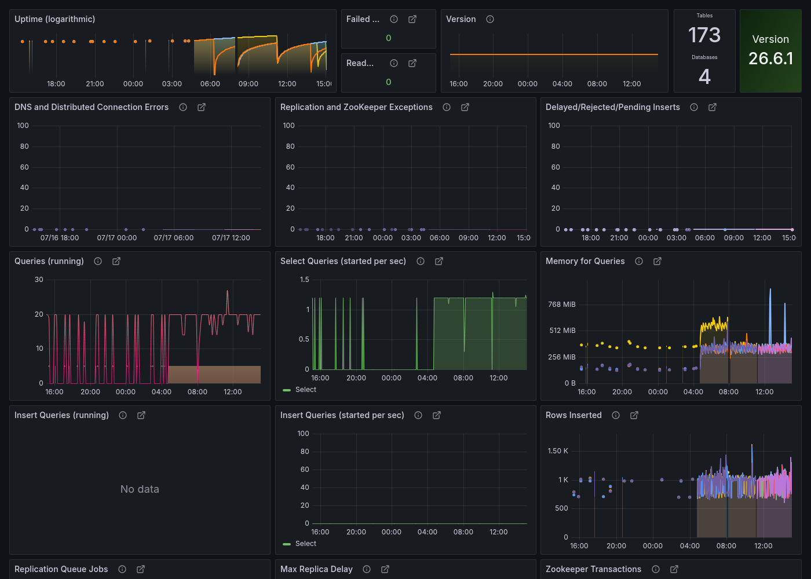
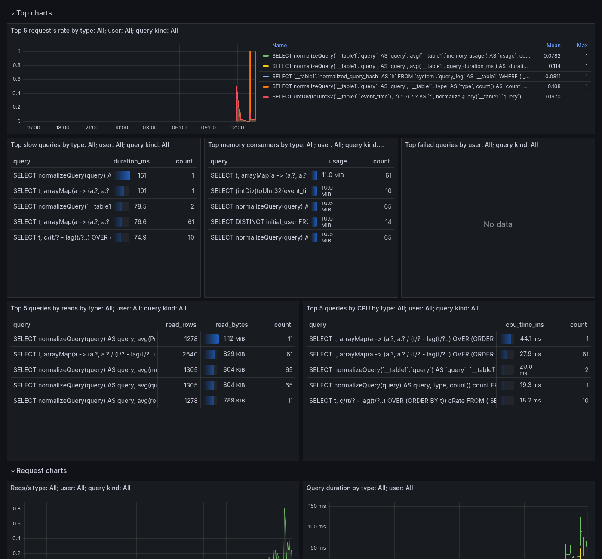

# ClickHouse + мониторинг на kind

Инструкция по развёртыванию ClickHouse с мониторингом через VictoriaMetrics и Grafana в локальном Kubernetes кластере (kind).

## Предварительные требования

Перед началом убедитесь, что установлены:

- Docker
- [kind](https://kind.sigs.k8s.io/)
- kubectl
- Helm

Grafana Stack развёрнут согласно инструкции [VictoriaMetrics + Grafana Monitoring Stack на kind](victoriametrics-grafana-monitoring-on-kind.md).

## Структура файлов

```
experiments/
├── cluster/
│   └── kind-config.yaml
├── monitoring/
│   └── vm-values.yaml
├── clickhouse/
│   └── operator/
│       └── clickhouse-operator-values.yaml
└── charts/
    ├── clickhouse-cluster/                # CR ClickHouseInstallation, один чарт на оба кластера
    │   ├── values.yaml                    # дефолт = финальное состояние (с backup, см. clickhouse-backup-setup.md)
    │   ├── values-step5-base.yaml         # состояние на этом шаге: backup.enabled: false
    │   └── values-test2.yaml              # оверрайд для второго кластера (namespace clickhouse-2)
    └── monitoring-extras/                 # ClickHouse datasource(s), дашборды, vmservicescrape оператора
        └── dashboards/
            ├── altinity-clickhouse-operator-dashboard.json
            └── altinity-clickhouse-queries-dashboard.json
```

## Шаг 1. Создание kind кластера

Создание кластера описано в инструкции [VictoriaMetrics + Grafana Monitoring Stack на kind](victoriametrics-grafana-monitoring-on-kind.md).

## Шаг 2. Установка clickhouse-operator

`clickhouse-operator` от Altinity управляет жизненным циклом ClickHouse кластеров в Kubernetes — создаёт поды, сервисы, конфигурации и следит за состоянием инсталляций через custom resource `ClickHouseInstallation` (CHI).

В values мы задаём два ключевых параметра:

- `watch.namespaces.include: [clickhouse, clickhouse-2]` — список namespace, за которыми следит оператор. Без этого параметра оператор смотрит только на свой собственный namespace и не увидит CHI в других namespace. Список нужно расширять при добавлении новых кластеров в новые namespace — см. [«Несколько кластеров в разных namespace»](#несколько-кластеров-в-разных-namespace).
- `metrics.enabled: true` — включает экспорт метрик оператора в Prometheus-формате. Метрики доступны на портах `ch-metrics` (8888) и `op-metrics` (9999) и содержат информацию о состоянии всех ClickHouse инсталляций.

```bash
mkdir -p clickhouse/operator
```

```yaml
# clickhouse/operator/clickhouse-operator-values.yaml
configs:
  files:
    config.yaml:
      watch:
        namespaces:
          include:
            - clickhouse
metrics:
  enabled: true
```

Добавьте репозиторий и установите оператор:

```bash
helm repo add clickhouse-operator https://docs.altinity.com/clickhouse-operator/
helm repo update
helm install clickhouse-operator clickhouse-operator/altinity-clickhouse-operator \
  --namespace clickhouse-operator \
  --create-namespace \
  --values clickhouse/operator/clickhouse-operator-values.yaml
```

Проверьте что оператор запущен:

```bash
kubectl get pods -n clickhouse-operator
```

Под должен быть `2/2 Running` — второй контейнер отвечает как раз за экспорт метрик (`metrics.enabled: true`).

## Шаг 3. Деплой ClickHouseInstallation

`ClickHouseInstallation` (CHI) — это custom resource, который описывает желаемое состояние ClickHouse кластера. Оператор читает этот манифест и создаёт все необходимые объекты: StatefulSet, Pod, Service, ConfigMap.

В манифесте определяются:

**Пользователь для мониторинга** — создаётся отдельный пользователь `monitoring` с паролем вместо использования пользователя `default`. Это важно по нескольким причинам:

- пользователь `default` по умолчанию ограничен сетевым доступом только с localhost и IP самих подов ClickHouse
- профиль `readonly` запрещает `INSERT`/`ALTER`/DDL — Grafana получает доступ только на чтение
- сетевая политика `::/0` разрешает подключение с любого IP внутри кластера, что необходимо для Grafana pod

**Почему `readonly/readonly: 2`, а не встроенный дефолт `1`:** сам профиль `readonly` в ClickHouse переопределён на уровень настройки `readonly=2` (см. `spec.configuration.profiles` в манифесте). Встроенный дефолт `readonly=1` блокирует **любое** изменение `SETTINGS` в теле запроса — а панели Grafana (и operator-дашборд, и queries-дашборд) сами отправляют `SETTINGS skip_unavailable_shards=1` вместе с запросом к `cluster('all-sharded', ...)`, чтобы не падать, если часть шардов недоступна. При `readonly=1` такие запросы завершаются ошибкой `Cannot modify 'skip_unavailable_shards' setting in readonly mode` — панели показывают ошибку датасорса вместо данных. `readonly=2` по-прежнему запрещает `INSERT`/`ALTER`/DDL (пользователь `monitoring` не может изменить данные), но разрешает переопределение `SETTINGS` в запросе — этого достаточно и безопасно для дашбордов.

**Топология кластера** — 1 шард и 2 реплики. Оператор создаст два пода: `chi-chi-test-test-0-0-0` и `chi-chi-test-test-0-1-0`. Для production репликация требует ZooKeeper или ClickHouse Keeper, в данном примере реплики независимы.

Разворачивается чартом `clickhouse-cluster` — этот же чарт позже в [clickhouse-backup-setup.md](clickhouse-backup-setup.md) добавит sidecar `clickhouse-backup` и PVC поверх этой же базы. Чтобы на этом шаге собрать именно "голый" кластер без backup, накладываем `values-step5-base.yaml`:

```yaml
# charts/clickhouse-cluster/values-step5-base.yaml
backup:
  enabled: false
```

Эквивалент CR, который в итоге уходит оператору (шаблон `templates/clickhouseinstallation.yaml` + `values.yaml` + `values-step5-base.yaml`):

```yaml
apiVersion: "clickhouse.altinity.com/v1"
kind: ClickHouseInstallation
metadata:
  name: chi-test
  namespace: clickhouse
spec:
  configuration:
    profiles:
      # readonly=1 (встроенный дефолт) блокирует любой SETTINGS в теле запроса — ломает
      # панели Grafana, которые шлют `SETTINGS skip_unavailable_shards=1`.
      # readonly=2 по-прежнему запрещает INSERT/ALTER/DDL, но разрешает переопределение SETTINGS.
      readonly/readonly: 2
    users:
      # Создаём отдельного пользователя для мониторинга
      monitoring/password: "monitoring"
      # Разрешаем подключение с любого IP внутри кластера
      monitoring/networks/ip:
        - "::/0"
      # Профиль readonly (уровень 2, см. выше) — без изменения данных, но с SETTINGS
      monitoring/profile: readonly
    clusters:
      - name: "test"
        layout:
          shardsCount: 1
          replicasCount: 2
```

Установите чарт:

```bash
helm upgrade --install chi-test ./charts/clickhouse-cluster \
  --namespace clickhouse --create-namespace \
  --values charts/clickhouse-cluster/values-step5-base.yaml
```

Следите за статусом:

```bash
kubectl get chi -n clickhouse -w
```

Дождитесь статуса `Completed`. Первый прогон занимает пару минут — оператор последовательно поднимает оба пода (`chi-chi-test-test-0-0-0`, затем `chi-chi-test-test-0-1-0`), каждый со своим PVC.

## Шаг 4. Настройка мониторинга

### VMServiceScrape для метрик оператора

`VMServiceScrape` — это custom resource VictoriaMetrics оператора, аналог `ServiceMonitor` в Prometheus. Он указывает VMAgent, откуда собирать метрики.

Данный манифест настраивает сбор метрик с сервиса `clickhouse-operator` в namespace `clickhouse-operator`:

- порт `ch-metrics` (8888) — метрики самих ClickHouse инсталляций: количество подов, статус, ошибки
- порт `op-metrics` (9999) — метрики самого оператора: количество обработанных CHI, время reconciliation

Рендерится чартом `monitoring-extras` (`templates/vmservicescrape-clickhouse-operator.yaml`), а не отдельным манифестом — относится к мониторингу конкретной инсталляции, но живёт вместе с остальной обвязкой Grafana/VictoriaMetrics.

```yaml
apiVersion: operator.victoriametrics.com/v1beta1
kind: VMServiceScrape
metadata:
  name: clickhouse-operator
  namespace: monitoring
spec:
  namespaceSelector:
    matchNames:
      - clickhouse-operator
  selector:
    matchLabels:
      app.kubernetes.io/name: altinity-clickhouse-operator
      app.kubernetes.io/instance: clickhouse-operator
  endpoints:
    - port: ch-metrics
    - port: op-metrics
```

### Datasource для Grafana

ConfigMap с лейблом `grafana_datasource: "1"` автоматически подхватывается sidecar-контейнером Grafana и добавляет datasource без ручной настройки через UI. Это позволяет управлять datasources как кодом (GitOps-подход) и не терять конфигурацию при рестарте Grafana.

Datasource настраивается на подключение к ClickHouse через балансировщик `clickhouse-chi-test`, который автоматически создаётся оператором и распределяет запросы между репликами. Используется пользователь `monitoring`, созданный в предыдущем шаге. Тоже рендерится чартом `monitoring-extras` (`templates/clickhouse-datasource-cm.yaml`, `range` по `values.clickhouseClusters`):

```yaml
apiVersion: v1
kind: ConfigMap
metadata:
  name: clickhouse-datasource
  namespace: monitoring
  labels:
    # Лейбл для автоматического подхвата sidecar контейнером Grafana
    grafana_datasource: "1"
data:
  clickhouse-datasource.yaml: |
    apiVersion: 1
    datasources:
      - name: chi-test
        type: vertamedia-clickhouse-datasource
        # Балансировщик созданный оператором для всех реплик кластера
        url: http://clickhouse-chi-test.clickhouse.svc.cluster.local:8123
        access: proxy
        basicAuth: true
        basicAuthUser: monitoring
        secureJsonData:
          basicAuthPassword: monitoring
        jsonData:
          usePost: true
          defaultDatabase: default
```

Установите чарт (одним релизом заодно поднимутся все дашборды из Шага 5 ниже и — опционально, см. [grafana-image-renderer-setup.md](grafana-image-renderer-setup.md) — рендерер скриншотов):

```bash
helm upgrade --install monitoring-extras ./charts/monitoring-extras \
  --namespace monitoring \
  --values charts/monitoring-extras/values.yaml
```

Проверьте, что VMServiceScrape в статусе `operational`:

```bash
kubectl get vmservicescrape -n monitoring clickhouse-operator
```

Проверьте, что datasource реально подключается (запрос выполняется от имени Grafana к ClickHouse через `basicAuth`):

```bash
kubectl port-forward -n monitoring svc/vm-grafana 3000:80 &
DS_UID=$(curl -s -u admin:admin http://localhost:3000/api/datasources | python3 -c "import json,sys; print([d['uid'] for d in json.load(sys.stdin) if d['name']=='chi-test'][0])")
curl -s -u admin:admin -X POST http://localhost:3000/api/datasources/uid/$DS_UID/health
# {"message":"OK","status":"OK"}
```

## Шаг 5. Деплой дашборда

Дашборды деплоятся аналогично datasource — через ConfigMap с лейблом `grafana_dashboard: "1"`. Sidecar-контейнер Grafana отслеживает такие ConfigMap и автоматически загружает JSON файлы дашбордов. Аннотация `grafana_folder=Databases` кладёт дашборд в папку `Databases` (требует `sidecar.dashboards.folderAnnotation` и `provider.foldersFromFilesStructure: true` в `monitoring/vm-values.yaml`, уже включено там же, где и для дашбордов PostgreSQL/WAL-G).

Такой подход позволяет:

- хранить дашборды в Git вместе с остальными манифестами
- автоматически восстанавливать дашборды после рестарта Grafana
- деплоить несколько дашбордов одной командой

Чарт `monitoring-extras` уже собирает ConfigMap для каждого файла из `charts/monitoring-extras/dashboards/*.json` (шаблон `templates/dashboards-cm.yaml`) — `helm upgrade --install` из Шага 4 выше уже применил и этот дашборд, ничего дополнительно делать не нужно. Обновить сам JSON (например, после `curl` свежей версии из апстрима) — переложить файл в `charts/monitoring-extras/dashboards/altinity-clickhouse-operator-dashboard.json` и повторить `helm upgrade`:

```bash
curl -s https://raw.githubusercontent.com/Altinity/clickhouse-operator/master/grafana-dashboard/Altinity_ClickHouse_Operator_dashboard.json \
  -o charts/monitoring-extras/dashboards/altinity-clickhouse-operator-dashboard.json
helm upgrade monitoring-extras ./charts/monitoring-extras --namespace monitoring
```

Дашборд появится в Grafana автоматически через 15-20 секунд.



**Известные особенности:** файл в этом репозитории — более новая версия дашборда (schemaVersion 39), чем актуальная на момент первого деплоя. Отличия:

- Добавлена переменная `$namespace` (`label_values(chi_clickhouse_metric_Uptime, exported_namespace)`), через которую теперь цепочкой резолвятся `$chi` и `$hostname` (`$namespace → $chi → $hostname`, все три — multi-select с `Alll`). Без неё панель ниже не может фильтроваться по namespace.
- Добавлена панель **«Throttled CPU, %»** (`container_cpu_cfs_throttled_seconds_total`). У неё есть два ограничения, оба — как в апстриме, не наши правки:
  - `pod=~"$hostname"` сравнивает лейбл `pod` (короткое имя пода из cAdvisor) со значением `$hostname`, которое для `chi_clickhouse_metric_*` — это **FQDN** (`chi-chi-test-test-0-0.clickhouse.svc.cluster.local`). Формат не совпадает, поэтому фильтр по хосту может не сработать.
  - Метрика `container_cpu_cfs_throttled_seconds_total` в cAdvisor вообще не появляется, пока для контейнера не задан CPU limit (throttling считается относительно quota) — на `chi-test`/`chi-test-2` в этом репозитории CPU limits не заданы, так что панель показывает «No data» до тех пор, пока их не добавить контейнеру `clickhouse` в шаблоне `charts/clickhouse-cluster/templates/clickhouseinstallation.yaml` (сейчас чарт не параметризует `resources` для основного контейнера, только для `clickhouse-backup`).

**Грабли (исправлено в этом репозитории):** панель `Failed...` (stat, `chi_clickhouse_metric_fetch_errors`) фильтровала по `fetch_type="system.metrics"` (через точку) — реальный оператор (используемая здесь версия `altinity-clickhouse-operator` 0.27.1) экспортирует это же значение лейбла как `system_metrics` (через подчёркивание). Фильтр никогда не матчился, панель показывала «No data» вместо настоящего значения (в норме `0`). Исправлено на `fetch_type="system_metrics"`.

**Известное ограничение upstream-JSON (не фиксили):** панель `Background Tasks` ссылается на метрику `chi_clickhouse_metric_BackgroundPoolTask`, которой в ClickHouse 26.x уже не существует — апстрим разбил единый пул на несколько (`BackgroundMergesAndMutationsPoolTask`, `BackgroundFetchesPoolTask`, `BackgroundCommonPoolTask` и др.), и панель отражает только часть картины (данные по `BackgroundSchedulePoolTask`/`BackgroundMovePoolTask` есть, по `BackgroundPoolTask` — нет). Панель не пустая целиком, поэтому не патчили — при желании показать полную картину нужно просуммировать актуальный набор `chi_clickhouse_metric_Background*PoolTask` метрик, что меняет семантику панели относительно апстрима.

Все остальные «No data» на этом дашборде (`DNS and Distributed Connection Errors`, `Replication and ZooKeeper Exceptions`, `Zookeeper Transactions`, `Insert Queries (running)`, `Detached parts`, `Mutations`) — легитимное отсутствие данных, а не баги: в этом стенде нет ZooKeeper/Keeper (реплики независимы, см. Шаг 3), ни разу не выполнялся реальный `INSERT` в ClickHouse, и нет отсоединённых партов/мутаций. Проверено напрямую через `system.events`/`system.mutations`/`system.detached_parts` в самом ClickHouse.

### ClickHouse Queries dashboard

Второй дашборд из того же upstream-репозитория — [`ClickHouse_Queries_dashboard.json`](https://github.com/Altinity/clickhouse-operator/blob/master/grafana-dashboard/ClickHouse_Queries_dashboard.json) (в этом репозитории сохранён под именем `altinity-clickhouse-queries-dashboard.json`). В отличие от operator-дашборда (метрики самого оператора из Prometheus/VictoriaMetrics), этот показывает данные из `system.query_log` самого ClickHouse — топ медленных запросов, потребление памяти/чтений/CPU, ошибки, request rate — то есть требует не Prometheus, а сам ClickHouse datasource. Панели `Top slow queries`/`Top memory consumers`/`Top queries by reads`/`Top queries by CPU` подсвечивают основную метрику градиентным баром (`gradient-gauge`, `continuous-blues`), `Top failed queries` — тем же баром, но красным (`continuous-reds`), так как ненулевой счётчик ошибок сам по себе тревожный сигнал, а не нейтральная величина.

Все панели используют переменную `$db` — датасорс-переменную с фильтром по типу `vertamedia-clickhouse-datasource`. Если датасорс этого типа один (`chi-test`), Grafana подставляет его автоматически; при нескольких (см. [«Несколько кластеров в разных namespace»](#несколько-кластеров-в-разных-namespace)) — выбирается вручную в UI.

Переменные `$exported_namespace`/`$chi` (K8S Namespace / K8S Clickhouse Installation) связаны с `$db`: запрос `$exported_namespace` фильтрует метрики оператора по `chi="${db:text}"` **или** по `exported_namespace="${db:text}"`, а `$chi` в свою очередь фильтрует по `exported_namespace="$exported_namespace"` — получается цепочка `$db → $exported_namespace → $chi`. Двойной фильтр (`or` по обоим лейблам) нужен потому, что соглашение «имя Grafana-датасорса совпадает с CHI» не универсально: в этом репозитории датасорс называется как CHI (`chi-test` ↔ `chi="chi-test"`), но на других стендах встречается и другое соглашение — датасорс называется как k8s-namespace инсталляции (`chi="clickhouse"` при этом единый на несколько неймспейсов, различаются только по `exported_namespace`). `$exported_namespace` матчит `${db:text}` по любому из двух лейблов, поэтому работает в обоих случаях.

**Важно:** нужно именно `${db:text}`, а не просто `$db`. У переменной `db` (тип `datasource`) `value` — это **UID** датасорса (`P3BD5D6D86D49CEBA`), а не его имя; `$db` интерполируется в `value`, поэтому фильтр `chi="$db"` сравнивает лейбл с UID и никогда не совпадает — `$exported_namespace`/`$chi` молча остаются пустыми («None» в выпадающем списке). Модификатор `:text` заставляет Grafana подставить отображаемое имя (`chi-test`/`chi-test-2`), которое и совпадает с лейблом `chi`. Проверялось через debug-логи плагина (`GF_LOG_FILTERS=tsdb.prometheus:debug`) — без него ошибка не видна ни в UI, ни в обычных логах, а рендер через `grafana-image-renderer` в полном `kiosk`-режиме её тоже не ловит (полный kiosk скрывает панель переменных, и Grafana просто не резолвит то, что не отрисовывается; нужен `kiosk=tv`, который прячет только навигацию).

**Известные особенности upstream-JSON (требуют правки перед деплоем):**

- Переменные `type`, `user`, `query_kind` (тип `query`, датасорс `$db`) хранят `query` как обычную строку — legacy-формат Grafana. Плагин `vertamedia-clickhouse-datasource` не реализует миграцию такого формата, из-за чего при загрузке дашборда всплывает баннер `Templating / Failed to upgrade legacy queries`. Фикс — привести `query` к объектному виду `{"query": "<тот же SQL>", "refId": "<name>-Variable-Query"}`, как уже сделано для `exported_namespace`/`chi` и во всех остальных дашбордах репозитория.
- Переменные `exported_namespace` и `chi` ссылаются на `${DS_PROMETHEUS}` — Prometheus datasource из оригинального экспорта, которого в кластере нет. Строковая (не объектная) ссылка на несуществующий датасорс — это и есть основная причина баннера `Failed to upgrade legacy queries`: Grafana не может смигрировать её в объектный `{type, uid}` формат. Хотя сами переменные нигде не используются в запросах панелей, их нужно починить, иначе дашборд не грузится целиком. Фикс — добавить скрытую (`hide: 2`) переменную `DS_PROMETHEUS` типа `datasource` с фильтром `query: "prometheus"` (тот же паттерн, что уже был в Operator Dashboard) и ссылаться на неё как на `{"type": "prometheus", "uid": "${DS_PROMETHEUS}"}`. **Не хардкодьте** `uid` буквальной строкой `"VictoriaMetrics"` — в этом демо-кластере UID датасорса действительно совпадает с его именем, но это совпадение, не гарантия: на реальном стенде обнаружился датасорс с именем `VictoriaMetrics`, но случайным UID (`P4169E866C3094E38`), и захардкоженная строка молча резолвилась не в тот датасорс. Переменная `DS_PROMETHEUS` резолвит UID динамически при каждой загрузке дашборда, независимо от конкретного значения.
- Панель «Reqs/s type: $type; user: $user; query kind: $query_kind» (id `14`) использует макрос `$rate(...)`, который в плагине `vertamedia-clickhouse-datasource` всегда разворачивается через ClickHouse-функцию `runningDifference()`. Начиная с определённой версии ClickHouse эта функция задепрекейчена и по умолчанию заблокирована (`DEPRECATED_FUNCTION: ... set allow_deprecated_error_prone_window_functions to enable it`) — панель тихо показывает «No data» без явной ошибки (старая Angular-панель не всплывает баннер на 500 от датасорса). **Не включайте** `allow_deprecated_error_prone_window_functions` — ClickHouse не просто устарел, а прямо предупреждает, что функция даёт некорректные результаты в распределённых/многоблочных запросах (а тут `cluster('all-sharded', ...)` — ровно такой случай). Фикс — переписать запрос панели на тот же безопасный паттерн с оконной функцией `lag(...) OVER (ORDER BY t)`, который уже использует соседняя панель «Top N request's rate» (бакетирование по `$interval` вместо хардкода).

Все правки уже внесены в `charts/monitoring-extras/dashboards/altinity-clickhouse-queries-dashboard.json` в этом репозитории — при повторном скачивании чистого JSON из upstream их нужно будет применить заново.

**Грабли: `label_values(...)` не поддерживает `or` (исправлено в этом репозитории).** Первая попытка починить двойное соглашение из абзаца выше — добавить `or` прямо в `label_values({chi="${db:text}"} or {exported_namespace="${db:text}"}, exported_namespace)`. Она приводит к ошибке `cannot parse matches[]=... expecting metricSelector` — `label_values(selector, label)` у Grafana выполняется через `/api/v1/series?match[]=<selector>`, а этот эндпоинт принимает только одиночный `metricSelector` без бинарных операторов. `or` работает лишь в instant-запросах через `/api/v1/query`. Фикс — заменить `label_values(...)` на `query_result(...)` (выполняется как instant-запрос) с `regex` для извлечения нужного лейбла из строки результата:
```
query_result({__name__ =~ "chi_clickhouse_metric_Uptime|chi_clickhouse_metric_fetch_errors", chi="${db:text}"} or {__name__ =~ "chi_clickhouse_metric_Uptime|chi_clickhouse_metric_fetch_errors", exported_namespace="${db:text}"})
regex: /exported_namespace="([^"]+)"/
```
Переменная `chi` осталась на `label_values(...)` без изменений — там нет `or` (одиночный матчер `exported_namespace="$exported_namespace"`), этот путь и раньше работал нормально.

Диагностика такого рода ошибок (панель молча показывает «No data») требует реального рендера — прямые запросы к ClickHouse через `datasource/proxy` с руками подобранными параметрами могут случайно воспроизводить другой (рабочий) вариант запроса. Надёжный способ — включить debug-логи плагина datasource (`kubectl set env deployment/vm-grafana -n monitoring GF_LOG_FILTERS="plugin.vertamedia-clickhouse-datasource:debug"`) и посмотреть логи `grafana-image-renderer` (см. [настройку рендерера](grafana-image-renderer-setup.md)) — headless Chromium логирует ошибки консоли браузера с полным URL, включая точный сгенерированный SQL:

```bash
kubectl logs -n monitoring -l app=grafana-image-renderer --tail=200 | grep -i "500\|error"
```

Уже применён вместе с остальными дашбордами на Шаге 4 (файл лежит в `charts/monitoring-extras/dashboards/altinity-clickhouse-queries-dashboard.json`). Обновление до свежей версии из апстрима — так же, как и для operator-дашборда:

```bash
curl -s https://raw.githubusercontent.com/Altinity/clickhouse-operator/master/grafana-dashboard/ClickHouse_Queries_dashboard.json \
  -o charts/monitoring-extras/dashboards/altinity-clickhouse-queries-dashboard.json
helm upgrade monitoring-extras ./charts/monitoring-extras --namespace monitoring
```

Проверить, что датасорс реально отвечает на запросы (тот же путь, что использует панель дашборда — proxy к ClickHouse через Grafana):

```bash
DS_UID=$(curl -s -u admin:admin http://localhost:3000/api/datasources | python3 -c "import json,sys; print([d['uid'] for d in json.load(sys.stdin) if d['name']=='chi-test'][0])")
curl -s -u admin:admin -G "http://localhost:3000/api/datasources/proxy/uid/$DS_UID/" \
  --data-urlencode "query=SELECT count() FROM system.query_log FORMAT JSON"
```



Панель `Top failed queries` пустая легитимно — в `system.query_log` этого кластера нет ни одной записи с `exception != ''` (проверено напрямую в ClickHouse), т.е. отражает реальное отсутствие ошибок, а не сломанный запрос.

**Дополнительные панели (добавлены в этом репозитории, не из апстрима):** в ряду `Top charts` — `Top queries by reads` (`avg(read_rows)`/`avg(read_bytes)`, сортировка по `read_bytes`) и `Top queries by CPU` (`avg(ProfileEvents['UserTimeMicroseconds'] + ProfileEvents['SystemTimeMicroseconds']) / 1000` — CPU-время в мс, `ProfileEvents` в `system.query_log` это колонка типа `Map(String, UInt64)`). Обе используют те же переменные фильтрации (`$type`/`$user`/`$query_kind`/`$min_duration_ms`/`$max_duration_ms`/`$top`), что и остальные Top-панели.

Скриншот выше сделан через `grafana-image-renderer` (см. [настройку рендерера](grafana-image-renderer-setup.md)) — по умолчанию рендерер выключен (`imageRenderer.enabled: false` в `charts/monitoring-extras/values.yaml`), включается через `--set imageRenderer.enabled=true` только когда нужен новый скриншот.

## Несколько кластеров в разных namespace

Один оператор умеет обслуживать много `ClickHouseInstallation` в разных namespace — под это уже рассчитаны и оператор, и оба дашборда. В репозитории вторым примером развёрнут `chi-test-2` в namespace `clickhouse-2` (кластер `test2`), чтобы явно проверить эту схему на практике — как второй **релиз того же чарта** `clickhouse-cluster`, а не отдельный манифест.

Что нужно на каждый новый кластер/namespace:

1. **Namespace попадает в список оператора.** Добавить его в `watch.namespaces.include` в `clickhouse/operator/clickhouse-operator-values.yaml` и накатить `helm upgrade` — без этого оператор не увидит CHI в новом namespace.
2. **Новый релиз чарта `clickhouse-cluster`** с оверрайдом `namespace`/`chiName`/`clusterName`/`backup.s3.pathPrefix` — в репозитории это `charts/clickhouse-cluster/values-test2.yaml`:
   ```bash
   helm upgrade --install chi-test-2 ./charts/clickhouse-cluster \
     --namespace clickhouse-2 --create-namespace \
     --values charts/clickhouse-cluster/values-step5-base.yaml \
     --values charts/clickhouse-cluster/values-test2.yaml
   ```
3. **Отдельный Grafana datasource** — уже в `charts/monitoring-extras/values.yaml` (`clickhouseClusters` — список из двух элементов, `chi-test`/`chi-test-2`, с уникальными `name`/`url`, указывающими на балансировщик соответствующего кластера: `clickhouse-<chi-name>.<namespace>.svc.cluster.local`); при добавлении третьего кластера — просто дописать туда ещё один элемент и повторить `helm upgrade monitoring-extras`.

Дальше ничего вручную донастраивать не нужно — оба дашборда уже параметризованы под multi-cluster:

- **Altinity ClickHouse Operator Dashboard** — единственный сервис оператора отдаёт метрики (`chi_clickhouse_metric_*`) сразу по всем CHI, которые он видит, с лейблами `exported_namespace`/`chi`. Переменные `$exported_namespace`/`$chi` на дашборде подхватывают новые значения автоматически — новый кластер просто появляется в выпадающих списках.
- **Altinity ClickHouse Queries Dashboard** — переменная `$db` (тип `datasource`, фильтр по плагину `vertamedia-clickhouse-datasource`) выводит все датасорсы этого типа, так что новый датасорс из шага 3 сразу становится доступен для выбора в дашборде без правки самого JSON.

Проверка, что новый кластер реально виден по обоим путям:

```bash
# метрики оператора по новому namespace/chi (после port-forward vmsingle на 8428)
curl -s "http://localhost:8428/api/v1/query?query=chi_clickhouse_metric_Uptime" | \
  python3 -c "import json,sys; [print(r['metric'].get('exported_namespace'), r['metric'].get('chi')) for r in json.load(sys.stdin)['data']['result']]"

# новый datasource и его health (после port-forward vm-grafana на 3000)
curl -s -u admin:admin http://localhost:3000/api/datasources | python3 -c "import json,sys; [print(d['name'], d['url']) for d in json.load(sys.stdin) if 'chi-test' in d['name']]"
```

## Шаг 6. Доступ к Grafana

```bash
kubectl port-forward -n monitoring svc/vm-grafana 3000:80
```

Откройте [http://localhost:3000](http://localhost:3000)

- Login: `admin`
- Password: `admin`

## Проверка

| Компонент | Команда |
|---|---|
| Поды оператора | `kubectl get pods -n clickhouse-operator` (ожидаем `2/2 Running`) |
| Поды ClickHouse | `kubectl get pods -n clickhouse` (`chi-chi-test-test-0-0-0`, `chi-chi-test-test-0-1-0`, оба `1/1 Running`) |
| Статус CHI | `kubectl get chi -n clickhouse` (`STATUS: Completed`) |
| Сервисы ClickHouse | `kubectl get svc -n clickhouse` (среди прочих — балансировщик `clickhouse-chi-test`) |
| VMServiceScrape | `kubectl get vmservicescrape -n monitoring clickhouse-operator` (`operational`) |
| Таргеты VMAgent | `kubectl port-forward -n monitoring svc/vmagent-vm-victoria-metrics-k8s-stack 8429:8429` → http://localhost:8429/targets — оба порта (`ch-metrics`, `op-metrics`) должны быть `up` |
| Datasource в Grafana | `curl -s -u admin:admin http://localhost:3000/api/datasources` — должен быть `chi-test` типа `vertamedia-clickhouse-datasource` |
| Дашборды в Grafana | `curl -s -u admin:admin "http://localhost:3000/api/search?query=ClickHouse"` — должны вернуться `Altinity ClickHouse Operator Dashboard` и `Altinity ClickHouse Queries Dashboard`, оба в папке `Databases` |
| Второй кластер (`chi-test-2`) | `kubectl get chi -n clickhouse-2` (`STATUS: Completed`), `kubectl get pods -n clickhouse-2` (оба пода `1/1 Running`) |
| Метрики второго кластера | `curl -s "http://localhost:8428/api/v1/label/chi/values"` (после port-forward vmsingle) — должны быть и `chi-test`, и `chi-test-2` |
