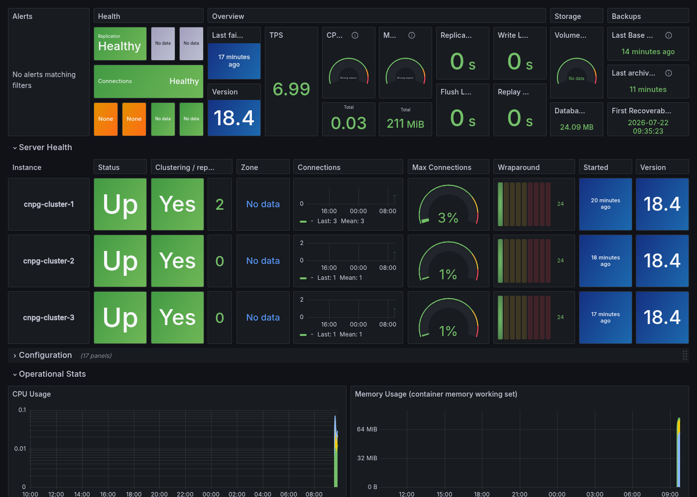

# CloudNativePG: второй Postgres-оператор бок о бок с Zalando

Инструкция по развёртыванию [CloudNativePG](https://cloudnative-pg.io/) (CNPG) — второго, независимого оператора PostgreSQL — в том же kind-кластере, что и уже описанный [Zalando `postgres-operator`](postgres-cluster-deployment-with-monitoring.md). Цель — сравнить два оператора на практике: разные CRD (`Cluster` vs `postgresql`), разные namespace, но общий MinIO для бэкапов и общий стек VictoriaMetrics/Grafana для мониторинга. Один не заменяет другой — оба могут работать в кластере одновременно.

## Предварительные требования

- Docker, [kind](https://kind.sigs.k8s.io/), kubectl, Helm
- kind-кластер уже создан (см. [VictoriaMetrics + Grafana Monitoring Stack на kind](victoriametrics-grafana-monitoring-on-kind.md))
- `victoria-metrics-k8s-stack` уже развёрнут в namespace `monitoring` (та же инструкция)
- MinIO уже развёрнут в namespace `minio` (см. [«Настройка бэкапа PostgreSQL через WAL-G»](postgres-walg-backup-setup.md), шаг 1) — если ещё не разворачивали, команда та же:
  ```bash
  helm repo add minio https://charts.min.io/
  helm install minio minio/minio \
    --namespace minio --create-namespace \
    --set rootUser=minioadmin \
    --set rootPassword=minioadmin \
    --set mode=standalone \
    --set persistence.size=5Gi \
    --set resources.requests.memory=512Mi
  ```
- Zalando `postgres-operator`/`postgres-cluster` **не обязателен** для этой инструкции — CNPG разворачивается независимо. Если он уже стоит, ничего в нём менять не нужно: разные CRD, разные namespace.

## Структура файлов

```
experiments/
├── cnpg/
│   └── operator/
│       └── cnpg-operator-values.yaml      # values cnpg/cloudnative-pg — podMonitorEnabled/grafanaDashboard выключены
└── charts/
    ├── cnpg-cluster/                      # CR Cluster (CNPG) + ScheduledBackup + VMPodScrape
    │   ├── Chart.yaml
    │   ├── values.yaml
    │   └── templates/
    │       ├── cluster.yaml               # Cluster: instances, storage, barmanObjectStore backup
    │       ├── scheduledbackup.yaml        # ScheduledBackup: cron-расписание автоматических бэкапов
    │       └── vmpodscrape.yaml            # VMPodScrape вместо VMServiceScrape — см. Шаг 4
    └── monitoring-extras/
        ├── dashboards/
        │   └── cloudnative-pg-cluster-dashboard.json   # официальный дашборд cloudnative-pg/grafana-dashboards
        └── templates/
            └── vmpodscrape-cnpg-operator.yaml           # метрики самого оператора (:8080)
```

## Шаг 1. Установка оператора CloudNativePG

В отличие от Zalando `postgres-operator` (CRD `postgresql`, namespace `postgres-operator`) и Altinity `clickhouse-operator`, CNPG использует CRD `Cluster` (`postgresql.cnpg.io/v1`) и по умолчанию следит за **всеми** namespace кластера (`clusterWide: true`) — в отличие от ClickHouse-оператора, здесь не нужно вручную перечислять namespace в `watch`.

Чарт оператора умеет сам создать `PodMonitor` (`monitoring.podMonitorEnabled`) и ConfigMap с дашбордом Grafana (`monitoring.grafanaDashboard.create`) — оба выключены в `cnpg/operator/cnpg-operator-values.yaml`:

```yaml
# cnpg/operator/cnpg-operator-values.yaml
monitoring:
  podMonitorEnabled: false   # PodMonitor — CRD Prometheus Operator, которого в этом репозитории нет
  grafanaDashboard:
    create: false            # дашборд вендорится централизованно в charts/monitoring-extras
```

`podMonitorEnabled: true` создал бы объект `monitoring.coreos.com/v1 PodMonitor` — CRD Prometheus Operator, которого в этом кластере нет (здесь используются CRD VictoriaMetrics Operator, см. Шаг 4). Дашборд аналогично не самопровизионится оператором, а вендорится вместе с остальными дашбордами в `charts/monitoring-extras/dashboards/`.

```bash
helm repo add cnpg https://cloudnative-pg.github.io/charts
helm repo update cnpg
helm upgrade --install cnpg-operator cnpg/cloudnative-pg \
  --namespace cnpg-system --create-namespace \
  -f cnpg/operator/cnpg-operator-values.yaml
```

Проверьте, что оператор запущен:

```bash
kubectl get pods -n cnpg-system
# cnpg-operator-cloudnative-pg-xxxxx   1/1   Running
```

## Шаг 2. Бакет и креды для бэкапа в MinIO

CNPG бэкапится в тот же бакет `postgres-backups`, что и WAL-G, но под своим префиксом (`cnpg/`), чтобы не пересекаться с префиксом WAL-G (`spilo/postgres-cluster`):

```bash
MINIO_POD=$(kubectl get pods -n minio -l app=minio -o jsonpath="{.items[0].metadata.name}")
kubectl exec -n minio "$MINIO_POD" -- mc alias set local http://localhost:9000 minioadmin minioadmin
kubectl exec -n minio "$MINIO_POD" -- mc mb local/postgres-backups   # no-op, если бакет уже создан для WAL-G
```

Креды доступа к S3 не темплейтятся в чарт (как и `walg-config` для Zalando-кластера — см. [«Настройка бэкапа PostgreSQL через WAL-G»](postgres-walg-backup-setup.md)) — секрет создаётся вручную, чтобы реальные креды не попадали в values-файлы в git. Ключи именно `ACCESS_KEY_ID`/`ACCESS_SECRET_KEY` — так их называет `s3Credentials` в CR `Cluster` (см. Шаг 3):

```bash
kubectl create namespace cnpg
kubectl create secret generic cnpg-minio-creds -n cnpg \
  --from-literal=ACCESS_KEY_ID=minioadmin \
  --from-literal=ACCESS_SECRET_KEY=minioadmin
# label, чтобы оператор перезапустил кластер при смене кредов, не только при первом создании
kubectl label secret cnpg-minio-creds -n cnpg cnpg.io/reload=true
```

## Шаг 3. Деплой Cluster + ScheduledBackup

Чарт `cnpg-cluster` рендерит `Cluster` (аналог `postgresql` CR у Zalando) и `ScheduledBackup` (аналог `BACKUP_SCHEDULE` у WAL-G). Дефолты в `values.yaml` намеренно повторяют форму `charts/postgres-cluster/values-production.yaml` — PostgreSQL 18, 3 инстанса, расписание бэкапов `02:00` — чтобы сравнение двух операторов было на сопоставимой нагрузке:

```yaml
# charts/cnpg-cluster/values.yaml (ключевые поля)
postgresql:
  imageName: ghcr.io/cloudnative-pg/postgresql:18
  instances: 3
  storageSize: 1Gi

backup:
  endpointURL: http://minio.minio.svc.cluster.local:9000
  destinationPath: s3://postgres-backups/cnpg/cnpg-cluster
  credentialsSecretName: cnpg-minio-creds
  schedule: "0 0 2 * * *"   # 6 полей (с секундами) — формат robfig/cron, не 5-полевой cron Zalando
```

Резолвинг `imageName` — `ghcr.io/cloudnative-pg/postgresql:<major>` — это собственная схема тегов CNPG (плавающий major-тег, всегда последний патч), подтверждено в исходниках `_helpers.tpl` официального чарта `cloudnative-pg/charts`.

Бэкап настроен через нативное поле `.spec.backup.barmanObjectStore`, а не через новый [Barman Cloud Plugin](https://cloudnative-pg.io/plugin-barman-cloud/) (CNPG-I) — подробности и связанный риск см. в «Известных особенностях» ниже.

```bash
helm upgrade --install cnpg-cluster ./charts/cnpg-cluster --namespace cnpg
```

При установке Helm выводит предупреждение самого оператора (нормально, см. ниже):

```
Warning: Native support for Barman Cloud backups and recovery is deprecated and will be
completely removed in CloudNativePG 1.31.0. Found usage in: spec.backup.barmanObjectStore.
Please migrate existing clusters to the new Barman Cloud Plugin to ensure a smooth transition.
```

Следите за статусом:

```bash
kubectl get cluster -n cnpg -w
```

Бутстрап (initdb на primary → join двух реплик) занимает 1.5–2 минуты. Дождитесь:

```
NAME           AGE     INSTANCES   READY   STATUS                     PRIMARY
cnpg-cluster   5m      3           3       Cluster in healthy state   cnpg-cluster-1
```

Три пода (`cnpg-cluster-1/2/3`) размещаются оператором на разных worker-нодах автоматически — как и у Zalando-кластера, `kind-config.yaml` не менялся.

## Шаг 4. Мониторинг: VMPodScrape вместо VMServiceScrape

У `postgres-cluster`/`clickhouse-cluster` метрики собираются через `VMServiceScrape` — CR VictoriaMetrics Operator, указывающий на headless `Service`. У CNPG такого Service нет: каждый под инстанса сам отдаёт метрики на порту `metrics` (9187), без промежуточного Service — именно так рекомендует делать сам апстрим CNPG (через `PodMonitor`, после того как `Cluster.spec.monitoring.enablePodMonitor` был задепрекейчен).

Прямой аналог `PodMonitor` в VictoriaMetrics Operator — `VMPodScrape`. Он выбирает поды напрямую по лейблам, без Service:

```yaml
# charts/cnpg-cluster/templates/vmpodscrape.yaml
apiVersion: operator.victoriametrics.com/v1beta1
kind: VMPodScrape
metadata:
  name: cnpg-cluster
  namespace: monitoring
spec:
  namespaceSelector:
    matchNames:
      - cnpg
  selector:
    matchLabels:
      cnpg.io/cluster: cnpg-cluster
  podMetricsEndpoints:
    - port: metrics
```

Дашборд (Шаг 5) дополнительно использует метрики самого оператора (`controller_runtime_webhook_requests_total` — переменная «Operator Namespace»), поэтому в `monitoring-extras` есть второй `VMPodScrape` для пода оператора (`:8080/metrics`, тот же порт, что и в `PodMonitor`-шаблоне апстримного чарта):

```yaml
# charts/monitoring-extras/templates/vmpodscrape-cnpg-operator.yaml
selector:
  matchLabels:
    app.kubernetes.io/name: cloudnative-pg
    app.kubernetes.io/instance: cnpg-operator
podMetricsEndpoints:
  - port: metrics
```

Уже применяется вместе с `cnpg-cluster` из Шага 3 (`VMPodScrape` — часть чарта `cnpg-cluster`) и вместе с `monitoring-extras` из Шага 5 ниже (второй `VMPodScrape`, для оператора).

Проверьте, что оба таргета реально `up` в VMAgent:

```bash
kubectl port-forward -n monitoring svc/vmagent-vm-victoria-metrics-k8s-stack 8429:8429 &
curl -s "http://localhost:8429/api/v1/targets" | python3 -c "
import json,sys
d = json.load(sys.stdin)
for t in d['data']['activeTargets']:
    l = t.get('labels', {})
    if 'cnpg' in l.get('job','').lower():
        print(t['health'], l.get('job'), l.get('pod'), t.get('scrapeUrl'))
"
```

Ожидаемый вывод — 4 таргета `up` (1 оператор + 3 инстанса):

```
up monitoring/cnpg-operator cnpg-operator-cloudnative-pg-xxxxx http://<ip>:8080/metrics
up monitoring/cnpg-cluster cnpg-cluster-1 http://<ip>:9187/metrics
up monitoring/cnpg-cluster cnpg-cluster-2 http://<ip>:9187/metrics
up monitoring/cnpg-cluster cnpg-cluster-3 http://<ip>:9187/metrics
```

## Шаг 5. Дашборд Grafana

Официальный дашборд проекта опубликован в [`cloudnative-pg/grafana-dashboards`](https://github.com/cloudnative-pg/grafana-dashboards). Он вендорится в `charts/monitoring-extras/dashboards/cloudnative-pg-cluster-dashboard.json` тем же механизмом (`templates/dashboards-cm.yaml`), что и все остальные дашборды репозитория — ConfigMap с лейблом `grafana_dashboard: "1"`, автоподхват через sidecar Grafana.

Единственная правка перед вендорингом: переменная датасорса в оригинале называется `DS_PROMETHEUS` (Grafana-специфичный формат `${DS_PROMETHEUS}` для импорта «с инпутами») — переименована в `datasource` (со всеми `${DS_PROMETHEUS}` → `${datasource}` по тексту), чтобы совпадать с соглашением, которое уже использует большинство PostgreSQL-дашбордов этого репозитория (`postgresql-cluster-overview.json` и т.д.). Осталась одна неиспользуемая ссылка `DS_EXPRESSION` в метаданных `__inputs` — это инертный артефакт формата экспорта Grafana, не влияет на рендеринг (мы не проходим через flow «импорт с инпутами», а провизионируем ConfigMap напрямую).

```bash
helm upgrade --install monitoring-extras ./charts/monitoring-extras \
  --namespace monitoring \
  --values charts/monitoring-extras/values.yaml
```

Проверка через API, без браузера:

```bash
curl -s -u admin:admin "http://localhost:3000/api/search?query=CloudNativePG"
# title: "CloudNativePG", folderTitle: "Databases"
```

Скриншот (опционально, требует [grafana-image-renderer](grafana-image-renderer-setup.md); `monitoring/vm-values.yaml` в этом репозитории уже содержит `GF_RENDERING_SERVER_URL`/`GF_RENDERING_CALLBACK_URL`, включить нужно только сам сервис рендерера):

```bash
helm upgrade --install monitoring-extras ./charts/monitoring-extras \
  --namespace monitoring \
  --values charts/monitoring-extras/values.yaml \
  --set imageRenderer.enabled=true
kubectl rollout status deployment/grafana-image-renderer -n monitoring --timeout=180s

kubectl port-forward -n monitoring svc/vm-grafana 3000:80 &
curl -s -o cloudnative-pg-cluster-dashboard.png -u admin:admin \
  "http://localhost:3000/render/d/cloudnative-pg/cloudnativepg?width=1400&height=1000&from=now-24h&to=now&kiosk&var-namespace=cnpg&var-cluster=cnpg-cluster"
```



Секции **Health**/**Overview**/**Server Health** уже показывают реальные данные: `Replication` и `Connections` — `Healthy`, все три инстанса `Up`, версия PostgreSQL, TPS, и — благодаря Шагу 6 ниже — время последнего base backup и последнего архивирования WAL.

**Легитимные «No data» на этом дашборде (не баги):** панель `Zone` и все панели `Volume Space/Inode Usage` читают метрики `kubelet_volume_stats_*` — в этом стенде их 0 (`curl` к VictoriaMetrics `.../api/v1/query?query=kubelet_volume_stats_available_bytes` возвращает пустой `result`), потому что `victoria-metrics-k8s-stack` в конфигурации этого репозитория не скрейпит `/metrics/cadvisor` или volume-stats-endpoint kubelet'а — тот же класс отсутствующих данных, что и `DNS/Zookeeper`-панели на ClickHouse-дашбордах (см. [clickhouse-monitoring-stack-on-kind.md](clickhouse-monitoring-stack-on-kind.md)): не собирается, а не сломано.

## Шаг 6. Проверка бэкапа

Ручной бэкап через `Backup` CR (или `kubectl cnpg backup cnpg-cluster -n cnpg`, если установлен [kubectl-плагин cnpg](https://cloudnative-pg.io/docs/1.30/kubectl-plugin/)):

```bash
cat <<'EOF' | kubectl apply -f -
apiVersion: postgresql.cnpg.io/v1
kind: Backup
metadata:
  name: cnpg-cluster-manual-1
  namespace: cnpg
spec:
  cluster:
    name: cnpg-cluster
  method: barmanObjectStore
EOF

kubectl get backup cnpg-cluster-manual-1 -n cnpg -w
```

Дождитесь `phase: completed` (заняло ~5 секунд на кластере с одной пустой базой `app`), затем проверьте, что объекты реально появились в MinIO под своим префиксом:

```bash
kubectl exec -n minio "$MINIO_POD" -- mc ls --recursive local/postgres-backups/cnpg/
```

Помимо самого бэкапа (`.../base/<timestamp>/data.tar`) там уже будут и WAL-сегменты — непрерывное WAL-архивирование включается автоматически вместе с `barmanObjectStore`, как только primary становится доступен, ещё до первого `Backup`.

`ScheduledBackup` (Шаг 3) выполнит то же самое автоматически по расписанию `02:00` — руками достаточно один раз для проверки, что путь вообще работает.

## Известные особенности

**Barman Cloud Plugin vs нативный `barmanObjectStore` (не мигрировали, осознанно):** начиная с CNPG 1.26 нативная поддержка Barman Cloud (`.spec.backup.barmanObjectStore`) объявлена deprecated в пользу отдельного [Barman Cloud Plugin](https://cloudnative-pg.io/plugin-barman-cloud/) (CNPG-I) — отдельный оператор + CRD `ObjectStore` + gRPC-сайдкар на cert-manager. При установке чарта `cnpg-cluster` в этом репозитории оператор явно предупреждает (см. Шаг 3): **нативная поддержка будет полностью удалена в CNPG 1.31.0** — то есть в самой следующей версии, не «когда-нибудь». Для этого репозитория (песочница для сравнения операторов, не прод-миграция) нативное поле выбрано осознанно — на порядок меньше движущихся частей (один блок в CR вместо второго оператора), но при обновлении `cnpg/cloudnative-pg` до 1.31+ придётся переехать на плагин — тогда актуальны примеры из `examples/standalone-s3.yaml` официального чарта `cnpg/cluster` (`helm show values cnpg/cluster`, поле `recovery.pluginConfiguration`).

**VMPodScrape, а не VMServiceScrape (осознанное отличие от `postgres-cluster`/`clickhouse-cluster`):** оба других чарта в этом репозитории заводят собственный headless `Service` ради `VMServiceScrape`. Для CNPG так делать не стали — метрики и так торчат прямо на поде (`:9187`), Service давал бы только лишний объект ради единообразия. `VMPodScrape` — штатный аналог `VMServiceScrape` для этого случая, тот же VictoriaMetrics Operator.

**6-полевой cron у `ScheduledBackup`:** в отличие от `BACKUP_SCHEDULE` у Zalando/WAL-G (обычный 5-полевой cron, `"0 2 * * *"`), формат CNPG (`robfig/cron`) включает секунды первым полем — `"0 0 2 * * *"` для того же «раз в сутки в 02:00». Перепутать легко, ошибка не всегда очевидна сразу (`ScheduledBackup` с 5-полевым значением будет либо отклонён валидацией CRD, либо интерпретирован не так, как ожидалось, — поле `seconds` сдвигает всё остальное).

## Проверка

| Компонент | Команда |
|---|---|
| Под оператора | `kubectl get pods -n cnpg-system` (`1/1 Running`) |
| Статус кластера | `kubectl get cluster -n cnpg` (`STATUS: Cluster in healthy state`, `READY: 3`) |
| Поды инстансов | `kubectl get pods -n cnpg` (`cnpg-cluster-1/2/3`, все `1/1 Running`, на разных нодах — `kubectl get pods -n cnpg -o wide`) |
| VMPodScrape объекты | `kubectl get vmpodscrape -n monitoring` (`cnpg-cluster`, `cnpg-operator`, оба `operational`) |
| Таргеты VMAgent | `kubectl port-forward -n monitoring svc/vmagent-vm-victoria-metrics-k8s-stack 8429:8429` → `/api/v1/targets` — 4 таргета `up` (см. Шаг 4) |
| Дашборд в Grafana | `curl -s -u admin:admin "http://localhost:3000/api/search?query=CloudNativePG"` — в папке `Databases` |
| Скриншот рендерится (опционально) | `curl -s -o test.png -u admin:admin "http://localhost:3000/render/d/cloudnative-pg/cloudnativepg?width=800&height=400"` → `file test.png` возвращает `PNG image data` |
| ScheduledBackup | `kubectl get scheduledbackup -n cnpg` |
| Ручной бэкап | `kubectl get backup -n cnpg` (`PHASE: completed`) |
| Объекты в MinIO | `mc ls --recursive local/postgres-backups/cnpg/` (base backup + WAL-сегменты) |
| Изоляция от WAL-G | `mc ls local/postgres-backups/` — префиксы `cnpg/` и `spilo/` не пересекаются, оба кластера бэкапятся в общий бакет независимо |
