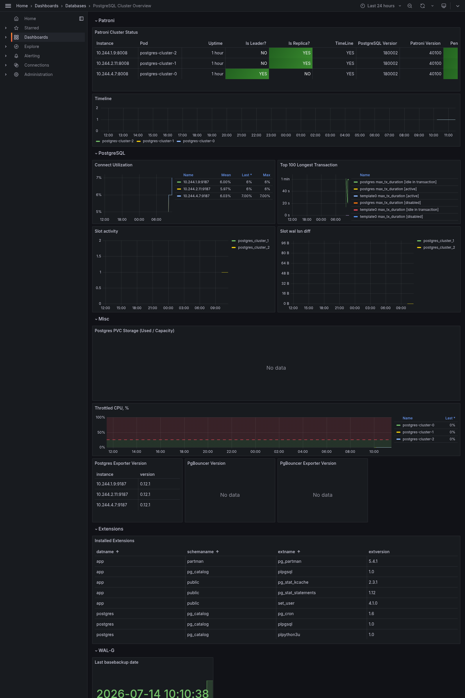

# Развёртывание PostgreSQL кластера с мониторингом в kind

Инструкция по развёртыванию PostgreSQL кластера с мониторингом через VictoriaMetrics и Grafana в Kubernetes (kind). Используется Zalando postgres-operator и prometheus-postgres-exporter.

## Предварительные требования

- Развёрнутый kind кластер с VictoriaMetrics + Grafana (см. инструкцию [VictoriaMetrics + Grafana Monitoring Stack на kind](victoriametrics-grafana-monitoring-on-kind.md))
- Docker
- kind
- kubectl
- Helm

## Структура файлов

```
experiments/
└── postgres/
    ├── operator/
    │   └── postgres-operator-values.yaml
    └── installations/
        ├── postgres-cluster.yaml
        └── monitoring/
            ├── postgres-metrics-svc.yaml
            └── vmservicescrape-postgres.yaml
```

## Шаг 1. Подготовка образа

Zalando postgres-operator использует образ Spilo — это кастомный образ PostgreSQL с Patroni для управления репликацией и failover.

## Шаг 2. Установка postgres-operator

Zalando postgres-operator управляет жизненным циклом PostgreSQL кластеров через custom resource `postgresql`. Он автоматически создаёт StatefulSet, Service, Secret с паролями и настраивает Patroni для репликации.

В values задаём образ Spilo — оператор будет использовать его для всех создаваемых кластеров.

```bash
mkdir -p postgres/operator
mkdir -p postgres/installations/monitoring
```

```yaml
# postgres/operator/postgres-operator-values.yaml
configGeneral: {}
#  docker_image: ghcr.io/zalando/spilo-18:4.1-p1

#configMajorVersionUpgrade:
#  major_version_upgrade_mode: "manual"
#  minimal_major_version: "14"
#  target_major_version: "18"

# WAL-G (configKubernetes.pod_environment_configmap/pod_environment_secret) отключён —
# требует MinIO и секрет walg-config, см. docs/postgres-walg-backup-setup.md
```

Без `docker_image` оператор использует свой образ Spilo по умолчанию (на момент написания — `ghcr.io/zalando/spilo-17:4.0-p3`). Это единый образ с бинарниками нескольких мажорных версий PostgreSQL — конкретная версия для кластера выбирается полем `postgresql.version` в манифесте кластера (Шаг 3), поэтому несовпадение тега образа (`spilo-17`) и версии PostgreSQL (`14`) — это нормально.

Добавьте репозиторий и установите оператор:

```bash
helm repo add postgres-operator-charts https://opensource.zalando.com/postgres-operator/charts/postgres-operator
helm repo update
helm install postgres-operator postgres-operator-charts/postgres-operator \
  --namespace postgres-operator \
  --create-namespace \
  --values postgres/operator/postgres-operator-values.yaml
```

Проверьте что оператор запущен:

```bash
kubectl get pods -n postgres-operator
```

## Шаг 3. Деплой PostgreSQL кластера

Манифест описывает PostgreSQL кластер из 3 инстансов (1 master + 2 replica) с встроенным sidecar экспортером метрик.

**Пользователи и базы данных** — оператор автоматически создаёт пользователя `monitoring` и базу данных `app` с владельцем `monitoring`. Пароли генерируются автоматически и сохраняются в Secrets.

**Sidecar prometheus-postgres-exporter** — контейнер запускается рядом с каждым PostgreSQL подом и экспортирует метрики на порту 9187. Подключается к PostgreSQL через Unix socket (`/var/run/postgresql`) от имени пользователя `postgres` без пароля — это безопасно так как доступ только внутри пода.

**additionalVolumes**:

- `socket-directory` — shared volume для Unix socket между postgres и экспортером. Монтируется во все контейнеры пода (`targetContainers: all`)
- `postgres-exporter-custom-queries` — опциональный ConfigMap с кастомными SQL запросами для экспортера. Помечен `optional: true` — экспортер запустится без него используя стандартные метрики

```yaml
# postgres/installations/postgres-cluster.yaml
apiVersion: "acid.zalan.do/v1"
kind: postgresql
metadata:
  name: postgres-cluster
  namespace: postgres
spec:
  teamId: "test"
  volume:
    size: 1Gi
  numberOfInstances: 3
  users:
    monitoring: []
  databases:
    app: monitoring
  postgresql:
    version: "14"
  sidecars:
    - name: prometheus-postgres-exporter
      image: prometheuscommunity/postgres-exporter:v0.12.1
      ports:
        - name: pg-exporter
          containerPort: 9187
          protocol: TCP
      resources:
        requests:
          cpu: 50m
          memory: 256Mi
        limits:
          cpu: 250m
          memory: 512Mi
      env:
        - name: CLUSTER_NAME
          valueFrom:
            fieldRef:
              apiVersion: v1
              fieldPath: metadata.labels['cluster-name']
        - name: DATA_SOURCE_NAME
          value: >-
            host=/var/run/postgresql user=postgres
            application_name=postgres_exporter
        - name: PG_EXPORTER_CONSTANT_LABELS
          value: "release=$(CLUSTER_NAME),namespace=$(POD_NAMESPACE)"
        - name: PG_EXPORTER_EXTEND_QUERY_PATH
          value: /etc/postgres-exporter/queries.yaml
  additionalVolumes:
    - name: socket-directory
      mountPath: /var/run/postgresql
      targetContainers:
        - all
      volumeSource:
        emptyDir: {}
    - name: postgres-exporter-custom-queries
      mountPath: /etc/postgres-exporter
      targetContainers:
        - prometheus-postgres-exporter
      volumeSource:
        configMap:
          name: postgresql-exporter-custom-queries
          optional: true
```

Примените манифест:

```bash
kubectl create namespace postgres
kubectl apply -f postgres/installations/postgres-cluster.yaml
kubectl get postgresql -n postgres -w
```

Дождитесь статуса `Running`. Затем проверьте поды — каждый должен быть `2/2`:

```bash
kubectl get pods -n postgres
# NAME                 READY   STATUS    RESTARTS   AGE
# postgres-cluster-0   2/2     Running   0          2m
# postgres-cluster-1   2/2     Running   0          2m
# postgres-cluster-2   2/2     Running   0          2m
```

> **На первом развёртывании (пока образ Spilo ещё не закэширован на нодах) это может занять 10+ минут** — каждая worker-нода тянет образ независимо (~1Гб), поды поднимаются последовательно один за другим. См. также «Известные особенности» ниже про `CreateFailed`.

## Шаг 4. Настройка мониторинга

### Service для метрик

Оператор создаёт сервисы только для PostgreSQL (порт 5432). Для сбора метрик нужен отдельный Headless Service который откроет порты экспортера и Patroni.

Порты:

- `9187` — prometheus-postgres-exporter (метрики PostgreSQL: активные соединения, транзакции, размеры таблиц, bloat и др.)
- `8008` — Patroni REST API (метрики репликации: роль инстанса master/replica, lag репликации, статус кластера)

Headless Service (`clusterIP: None`) создаёт DNS записи для каждого пода отдельно, что позволяет VMAgent собирать метрики с каждого инстанса независимо.

```yaml
# postgres/installations/monitoring/postgres-metrics-svc.yaml
apiVersion: v1
kind: Service
metadata:
  name: postgres-cluster-metrics
  namespace: postgres
  labels:
    application: spilo
    cluster-name: postgres-cluster
spec:
  selector:
    application: spilo
    cluster-name: postgres-cluster
  clusterIP: None
  ports:
    - name: pg-exporter
      port: 9187
      targetPort: 9187
    - name: patroni
      port: 8008
      targetPort: 8008
```

### VMServiceScrape

VMServiceScrape указывает VMAgent собирать метрики с созданного сервиса. Селектор по лейблам `application: spilo` и `cluster-name: postgres-cluster` позволяет точно таргетировать нужный кластер — удобно когда в namespace несколько кластеров.

```yaml
# postgres/installations/monitoring/vmservicescrape-postgres.yaml
apiVersion: operator.victoriametrics.com/v1beta1
kind: VMServiceScrape
metadata:
  name: postgres-cluster
  namespace: monitoring
spec:
  namespaceSelector:
    matchNames:
      - postgres
  selector:
    matchLabels:
      application: spilo
      cluster-name: postgres-cluster
  endpoints:
    - port: pg-exporter
      interval: 30s
    - port: patroni
      interval: 30s
      path: /metrics
```

Примените манифесты:

```bash
kubectl apply -f postgres/installations/monitoring/postgres-metrics-svc.yaml
kubectl apply -f postgres/installations/monitoring/vmservicescrape-postgres.yaml
kubectl get vmservicescrape -n monitoring postgres-cluster
# STATUS должен быть operational
```

## Шаг 5. Деплой дашборда

Дашборд деплоится через ConfigMap с лейблом `grafana_dashboard=1` — Grafana sidecar подхватывает его автоматически. Аннотация `grafana_folder=Databases` кладёт дашборд в папку `Databases` (требует `sidecar.dashboards.folderAnnotation` и `provider.foldersFromFilesStructure: true` в `monitoring/vm-values.yaml`).

```bash
kubectl create configmap postgresql-cluster-overview-dashboard \
  --from-file=monitoring/dashboards/postgresql-cluster-overview.json \
  --namespace monitoring \
  --dry-run=client -o yaml | \
kubectl label --local -f - grafana_dashboard=1 --dry-run=client -o yaml | \
kubectl annotate --local -f - grafana_folder=Databases --dry-run=client -o yaml | \
kubectl apply -f -
```

Дашборд появится в Grafana через 15-20 секунд.



> **Грабли (исправлено в этом репозитории):** в апстримном JSON переменная `namespace` имела `"allValue": "blank = nothing"` — это не служебный плейсхолдер, а буквальное значение, которое Grafana подставляет вместо `$namespace` при выборе `All` (значение по умолчанию). В результате при дефолтном выборе `All` запросы `scope`/`instance`-переменных и нескольких панелей (`Top 100 Longest Transaction`, `Slot activity`, `Slot wal lsn diff`, `Installed Extensions` и др.) превращались в `namespace="blank = nothing"` и никогда не матчились — весь дашборд показывал «No data» сразу после первого деплоя, без каких-либо явных ошибок. Исправлено два независимых бага: `"allValue"` очищено (пустая строка — обычное поведение "auto" для all-value), и несколько панелей/переменных, использовавших `namespace="$namespace"` (точное равенство), переведены на `namespace=~"$namespace"` (regex-match), как и остальные панели дашборда. Панель `Postgres PVC Storage` пуста по объективной причине: `kubelet_volume_stats_*` не собираются в `kind` (нет реального CSI со volume-метриками).

## Шаг 6. Мониторинг установленных extensions

Список расширений, реально установленных в каждой базе, — не то, что видно из манифеста кластера (`preparedDatabases.extensions` описывает только то, что поставил оператор при бутстрапе; расширения, добавленные вручную или другим способом, туда не попадают). Чтобы видеть актуальную картину в Grafana, используем уже подключённый, но неиспользуемый механизм `postgres-exporter-custom-queries` (см. Шаг 3) — добавляем туда SQL-запрос к `pg_extension`.

```yaml
# postgres/installations/monitoring/postgres-exporter-queries-cm.yaml
apiVersion: v1
kind: ConfigMap
metadata:
  name: postgresql-exporter-custom-queries
  namespace: postgres
data:
  queries.yaml: |
    pg_extension:
      query: |
        SELECT current_database()                    AS datname,
               extname,
               extversion,
               extnamespace::regnamespace::text       AS schemaname,
               1                                       AS installed
        FROM pg_extension;
      metrics:
        - datname:
            usage: "LABEL"
            description: "Database the extension is installed in"
        - extname:
            usage: "LABEL"
            description: "Extension name"
        - extversion:
            usage: "LABEL"
            description: "Installed extension version"
        - schemaname:
            usage: "LABEL"
            description: "Schema the extension is installed in"
        - installed:
            usage: "GAUGE"
            description: "Extension is installed (always 1)"
```

Метрика получает имя `pg_extension_installed` — `<ключ верхнего уровня>_<имя колонки>` — это соглашение имён у `postgres_exporter`, а не что-то заданное явно.

По умолчанию `DATA_SOURCE_NAME` экспортера (Шаг 3) не указывает `dbname` и коннектится только к одной базе (фактически `postgres`) — расширения из `app` (в т.ч. `pg_partman`) в метрики бы не попали. Включаем обход всех баз кластера:

```yaml
# postgres/installations/postgres-cluster.yaml, sidecars[0].env
- name: PG_EXPORTER_AUTO_DISCOVER_DATABASES
  value: "true"
```

> **Важно (компромисс):** `auto_discover_databases` заставляет экспортёр опрашивать *все* базы кластера этим же набором запросов, включая уже встроенные коллекторы (`pg_stat_statements`, `pg_locks` и т.д.) — не только наш кастомный запрос по extensions. Это увеличивает кардинальность вообще всех метрик экспортёра (каждая теперь размножается по числу баз), а не только целевой. Альтернатива — зафиксировать `dbname=app` в `DATA_SOURCE_NAME` без auto-discover: проще и без роста кардинальности, но тогда не видно расширений, установленных в системных базах (`postgres`, `template1`).

Примените ConfigMap (до пересоздания пода — он смонтирован как volume) и манифест кластера:

```bash
kubectl apply -f postgres/installations/monitoring/postgres-exporter-queries-cm.yaml
kubectl apply -f postgres/installations/postgres-cluster.yaml
kubectl get postgresql -n postgres -w
# STATUS: Updating -> Running (rolling restart всех подов из-за смены sidecar env)
```

Проверьте метрику:

```bash
kubectl exec -n postgres postgres-cluster-0 -c postgres -- curl -s http://localhost:9187/metrics | grep pg_extension_installed
```

> **Важно (грабли): гонка при добавлении ConfigMap к уже запущенному поду.** Volume `postgres-exporter-custom-queries` смонтирован с `optional: true`, поэтому при первом бутстрапе кластера (Шаг 3), когда `postgresql-exporter-custom-queries` ещё не существует, под стартует с пустым каталогом вместо файла. `postgres_exporter` перечитывает `queries.yaml` только по событию файловой системы (fsnotify) на смонтированном каталоге — а kubelet обновляет ConfigMap-volume асинхронно (обычно за 60-90 секунд после `kubectl apply`), причём само появление файла может не дать событие ровно в момент, когда экспортёр его пытается прочитать (виден `level=error msg="Failed to reload user queries" ... no such file or directory` в логах сайдкара, и на этом попытки заканчиваются — повторного реtry без нового события не будет). В результате `pg_extension_installed` не появляется вообще, хотя файл в контейнере уже фактически есть (`kubectl exec ... cat /etc/postgres-exporter/queries.yaml` покажет валидный YAML). Проверьте лог сайдкара:
>
> ```bash
> kubectl logs -n postgres postgres-cluster-0 -c prometheus-postgres-exporter | grep -i "reload user queries"
> ```
>
> Если там ошибка и метрики нет — не нужно пересоздавать под целиком (это вызвало бы Patroni failover на лидере). Экспортёр — самостоятельный контейнер в поде: убейте его процесс (PID 1), kubelet перезапустит только этот контейнер, `postgres`/Patroni не затронуты:
>
> ```bash
> for i in 0 1 2; do kubectl exec -n postgres postgres-cluster-$i -c prometheus-postgres-exporter -- kill 1; done
> ```
>
> После рестарта экспортёр читает уже присутствующий на диске файл при старте процесса (обычный путь загрузки конфига, а не fsnotify) — гонка тут не участвует.

В дашборд `monitoring/dashboards/postgresql-cluster-overview.json` добавлена таблица «Installed Extensions» (панель `Extensions`) с запросом:

```promql
group by (datname, schemaname, extname, extversion) (pg_extension_installed{namespace=~"$namespace"})
```

> **Важно (грабли):** кластер состоит из 3 реплик, и каждая репортит свои метрики независимо — если группировать `group by` с `instance` в списке (естественный первый вариант, раз кластер, а не одна база), таблица покажет один и тот же набор расширений трижды, по разу на под. Поле `instance` нужно убрать из `group by` — тогда VictoriaMetrics схлопнет одинаковые ряды с разных подов в один, что и требуется: расширения — свойство базы данных, а не конкретной реплики.

Порядок колонок в таблице задаётся через `transformations[].options.indexByName` в JSON дашборда (`datname: 0, schemaname: 1, extname: 2, extversion: 3`), сортировка — через `options.sortBy` панели (по тем же трём полям, в том же порядке).

## Проверка

| Компонент | Команда |
|---|---|
| Поды оператора | `kubectl get pods -n postgres-operator` |
| Поды PostgreSQL | `kubectl get pods -n postgres` |
| Статус кластера | `kubectl get postgresql -n postgres` |
| Сервисы | `kubectl get svc -n postgres` |
| VMServiceScrape | `kubectl get vmservicescrape -n monitoring postgres-cluster` |
| Таргеты VMAgent | `kubectl port-forward -n monitoring svc/vmagent-vm-victoria-metrics-k8s-stack 8429:8429` → http://localhost:8429/targets |
| Подключение к PostgreSQL | `kubectl exec -it postgres-cluster-0 -n postgres -- psql -U postgres -c "SELECT version();"` |
| Метрика установленных extensions | `kubectl exec -n postgres postgres-cluster-0 -c postgres -- curl -s http://localhost:9187/metrics \| grep pg_extension_installed` |

## Известные особенности

| Проблема | Решение |
|---|---|
| Warning при `kubectl apply` на CRD | CRD создан Helm без аннотации, использовать `kubectl replace -f` |
| Под не подхватывает новый образ | Удалить под вручную: `kubectl delete pod <name> -n postgres` |
| `kubectl get postgresql` показывает `CreateFailed`, хотя все поды `2/2 Running` | Оператор ждёт готовности StatefulSet ограниченное число попыток (200 retries) и на первом, медленном (из-за загрузки образа) бутстрапе кластера успевает истечь этим таймаутом раньше, чем поднимутся все 3 пода — сами поды при этом продолжают штатно стартовать через StatefulSet. Статус в CR остаётся устаревшим до следующей синхронизации. Форсировать ресинк: `kubectl rollout restart deployment postgres-operator -n postgres-operator` |
| Панели `PgBouncer Version` / `PgBouncer Exporter Version` на дашборде всегда пустые | Ожидаемо — PgBouncer в этом репозитории вообще не разворачивается (только Zalando `postgres-operator` + Patroni, без отдельного connection pooler'а). Панели оставлены как есть на случай, если PgBouncer добавят отдельно. |
| Панель `Postgres PVC Storage (Used / Capacity)` пустая | Ожидаемо — метрики `kubelet_volume_stats_*` не собираются в `kind` (нет реального CSI со volume-метриками). |
