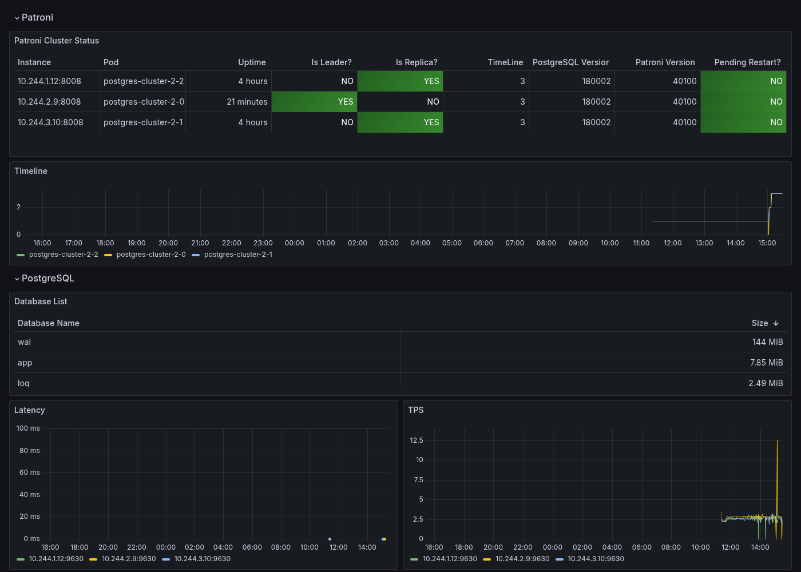
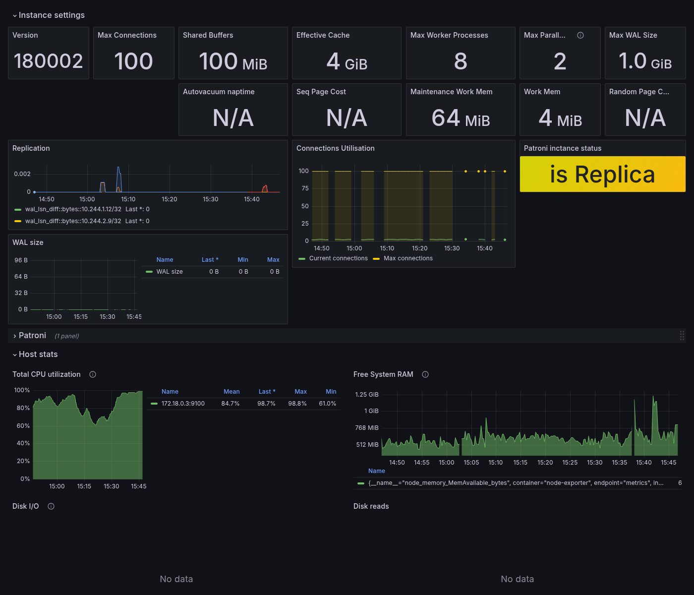
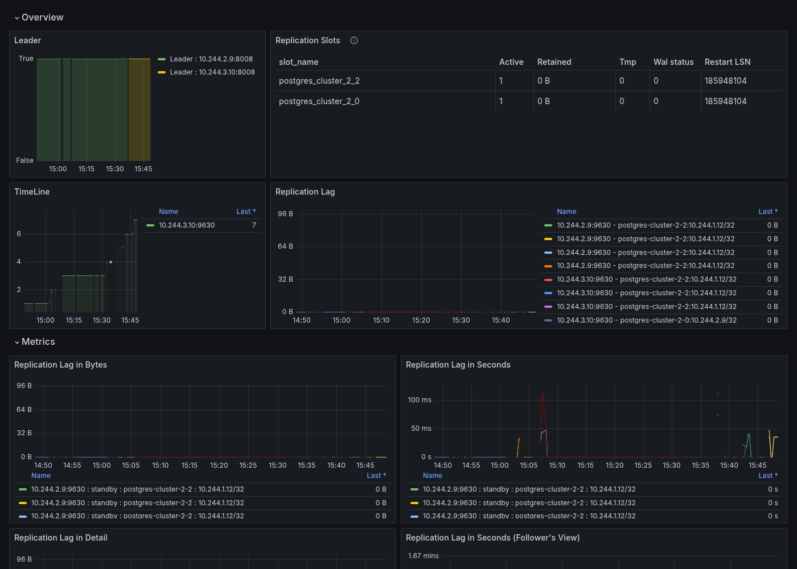

# PostgreSQL Monitoring Stack на kind

Инструкция по развёртыванию PostgreSQL кластера с мониторингом через VictoriaMetrics и Grafana в Kubernetes (kind). Используется Zalando postgres-operator и pg_exporter от pgsty.

---

## Предварительные требования

- Развёрнутый kind кластер с VictoriaMetrics + Grafana (см. инструкцию по ClickHouse Monitoring Stack)
- [Docker](https://docs.docker.com/get-docker/)
- [kind](https://kind.sigs.k8s.io/docs/user/quick-start/#installation)
- [kubectl](https://kubernetes.io/docs/tasks/tools/)
- [Helm](https://helm.sh/docs/intro/install/)

---

## Структура файлов

```
experiments/
└── postgres/
    ├── operator/
    │   └── postgres-operator-values.yaml
    └── installations/
        ├── postgres-cluster.yaml
        └── monitoring/
            ├── postgres-metrics-svc.yaml
            └── vmservicescrape-postgres.yaml
```

---

## Шаг 1. Подготовка образов

Zalando postgres-operator использует образ **Spilo** — кастомный образ PostgreSQL с Patroni для управления репликацией и failover.

**pg_exporter** от pgsty — альтернатива стандартному postgres_exporter с расширенными метриками и поддержкой auto-discovery баз данных. Работает на порту `9630`.

### Проблема multi-platform образов в kind

kind не умеет импортировать multi-platform образы напрямую — нужно явно указать digest нужной платформы. Для macOS Apple Silicon (arm64):

```bash
# Проверим доступные платформы
docker buildx imagetools inspect pgsty/pg_exporter:latest
```

Вывод покажет digest для каждой платформы:
```
Platform:  linux/amd64  sha256:5cc8a9f0...
Platform:  linux/arm64  sha256:37e40687...
```

Скачиваем именно arm64 digest и загружаем в kind:

```bash
# Скачать образ Spilo
docker pull ghcr.io/zalando/spilo-18:4.1-p1
kind load docker-image ghcr.io/zalando/spilo-18:4.1-p1

# Скачать pg_exporter по arm64 digest
docker pull pgsty/pg_exporter:latest@sha256:37e40687d75680f8644865073bdf28a0bf89032a94b858bb5c29f8cc0063e1b6
docker tag pgsty/pg_exporter:latest@sha256:37e40687d75680f8644865073bdf28a0bf89032a94b858bb5c29f8cc0063e1b6 pgsty/pg_exporter:arm64
docker save pgsty/pg_exporter:arm64 -o /tmp/pg_exporter.tar
kind load image-archive /tmp/pg_exporter.tar
```

Проверьте что образы загружены:

```bash
docker exec kind-worker crictl images | grep pg_exporter
```

---

## Шаг 2. Установка postgres-operator

Zalando postgres-operator управляет жизненным циклом PostgreSQL кластеров через custom resource `postgresql`. Он автоматически создаёт StatefulSet, Service, Secret с паролями и настраивает Patroni для репликации.

В values задаём образ Spilo `4.1-p1` — это первый тег поддерживающий PostgreSQL 18. Тег `4.0-p1` не существует.

```bash
mkdir -p postgres/operator
mkdir -p postgres/installations/monitoring
```

```yaml
# postgres/operator/postgres-operator-values.yaml
configGeneral:
  docker_image: ghcr.io/zalando/spilo-18:4.1-p1
```

Добавьте репозиторий и установите оператор:

```bash
helm repo add postgres-operator-charts https://opensource.zalando.com/postgres-operator/charts/postgres-operator
helm repo update

helm install postgres-operator postgres-operator-charts/postgres-operator \
  --namespace postgres-operator \
  --create-namespace \
  --values postgres/operator/postgres-operator-values.yaml
```

Проверьте что оператор запущен:

```bash
kubectl get pods -n postgres-operator
```

---

## Шаг 3. Обновление CRD

По умолчанию CRD оператора поддерживает PostgreSQL до версии 17. Чтобы добавить поддержку версии 18 нужно обновить CRD из master ветки репозитория.

Это необходимо делать вручную — `helm upgrade` не обновляет CRD автоматически, флаг `--include-crds` не поддерживается в текущей версии чарта. При этом `kubectl apply` выдаст warning об отсутствии аннотации — это нормально, используем `kubectl replace`:

```bash
kubectl replace -f https://raw.githubusercontent.com/zalando/postgres-operator/master/charts/postgres-operator/crds/postgresqls.yaml
```

Проверьте что версия 18 появилась:

```bash
kubectl get crd postgresqls.acid.zalan.do \
  -o jsonpath='{.spec.versions[0].schema.openAPIV3Schema.properties.spec.properties.postgresql.properties.version.enum}'
# Ожидаемый результат: ["14","15","16","17","18"]
```

---

## Шаг 4. Деплой PostgreSQL кластера

Манифест описывает PostgreSQL кластер из 3 инстансов (1 master + 2 replica) со встроенным sidecar экспортером метрик.

**Пользователи и базы данных** — оператор автоматически создаёт пользователя `monitoring` и базу данных `app`. Пароли генерируются автоматически и сохраняются в Secrets.

**Sidecar pg_exporter** — контейнер запускается рядом с каждым PostgreSQL подом и экспортирует метрики на порту `9630`. Подключается через Unix socket (`/var/run/postgresql`) от имени пользователя `postgres`. Флаг `imagePullPolicy: Never` обязателен — образ загружен локально в kind и не должен тянуться из registry.

**Ключевые переменные окружения:**
- `PG_EXPORTER_URL` — строка подключения через Unix socket
- `PG_EXPORTER_LABEL` — константные лейблы добавляемые ко всем метрикам (имя кластера, namespace)
- `PG_EXPORTER_AUTO_DISCOVERY` — автоматически собирать метрики со всех баз данных

**additionalVolumes:**
- `socket-directory` — shared volume для Unix socket между postgres и экспортером. Монтируется во все контейнеры пода (`targetContainers: all`)

```yaml
# postgres/installations/postgres-cluster.yaml
apiVersion: "acid.zalan.do/v1"
kind: postgresql
metadata:
  name: postgres-cluster
  namespace: postgres
spec:
  teamId: "test"
  volume:
    size: 1Gi
  numberOfInstances: 3
  users:
    monitoring: []
  databases:
    app: monitoring
  postgresql:
    version: "14"
  sidecars:
    - name: pg-exporter
      image: pgsty/pg_exporter:arm64
      imagePullPolicy: Never
      ports:
        - name: pg-exporter
          containerPort: 9630
          protocol: TCP
      resources:
        requests:
          cpu: 50m
          memory: 256Mi
        limits:
          cpu: 250m
          memory: 512Mi
      env:
        - name: CLUSTER_NAME
          valueFrom:
            fieldRef:
              apiVersion: v1
              fieldPath: metadata.labels['cluster-name']
        - name: PG_EXPORTER_URL
          value: "postgresql://postgres@/postgres?host=/var/run/postgresql&sslmode=disable"
        - name: PG_EXPORTER_LABEL
          value: "release=$(CLUSTER_NAME),namespace=$(POD_NAMESPACE)"
        - name: PG_EXPORTER_AUTO_DISCOVERY
          value: "true"
  additionalVolumes:
    - name: socket-directory
      mountPath: /var/run/postgresql
      targetContainers:
        - all
      volumeSource:
        emptyDir: {}
```

Примените манифест:

```bash
kubectl create namespace postgres
kubectl apply -f postgres/installations/postgres-cluster.yaml
kubectl get postgresql -n postgres -w
```

Дождитесь статуса `Running`. Проверьте поды — каждый должен быть `2/2`:

```bash
kubectl get pods -n postgres
# NAME                 READY   STATUS    RESTARTS   AGE
# postgres-cluster-0   2/2     Running   0          2m
# postgres-cluster-1   2/2     Running   0          2m
# postgres-cluster-2   2/2     Running   0          2m
```

---

## Шаг 5. Настройка мониторинга

### Service для метрик

Оператор создаёт сервисы только для PostgreSQL (порт 5432). Для сбора метрик нужен отдельный Headless Service.

**Порты:**
- `9630` — pg_exporter (метрики PostgreSQL)
- `8008` — Patroni REST API (метрики репликации: роль master/replica, lag, статус кластера)

Headless Service (`clusterIP: None`) создаёт DNS записи для каждого пода отдельно — VMAgent собирает метрики с каждого инстанса независимо.

```yaml
# postgres/installations/monitoring/postgres-metrics-svc.yaml
apiVersion: v1
kind: Service
metadata:
  name: postgres-cluster-metrics
  namespace: postgres
  labels:
    application: spilo
    cluster-name: postgres-cluster
spec:
  selector:
    application: spilo
    cluster-name: postgres-cluster
  clusterIP: None
  ports:
    - name: pg-exporter
      port: 9630
      targetPort: 9630
    - name: patroni
      port: 8008
      targetPort: 8008
```

### VMServiceScrape

`VMServiceScrape` указывает VMAgent собирать метрики с созданного сервиса. Селектор по лейблам `application: spilo` и `cluster-name: postgres-cluster` точно таргетирует нужный кластер.

```yaml
# postgres/installations/monitoring/vmservicescrape-postgres.yaml
apiVersion: operator.victoriametrics.com/v1beta1
kind: VMServiceScrape
metadata:
  name: postgres-cluster
  namespace: monitoring
spec:
  namespaceSelector:
    matchNames:
      - postgres
  selector:
    matchLabels:
      application: spilo
      cluster-name: postgres-cluster
  endpoints:
    - port: pg-exporter
      interval: 30s
    - port: patroni
      interval: 30s
      path: /metrics
```

Примените манифесты:

```bash
kubectl apply -f postgres/installations/monitoring/postgres-metrics-svc.yaml
kubectl apply -f postgres/installations/monitoring/vmservicescrape-postgres.yaml

kubectl get vmservicescrape -n monitoring postgres-cluster
# STATUS должен быть operational
```

---

## Шаг 6. Дашборды

Дашборды деплоятся не через ручной `kubectl create configmap`, а чартом `monitoring-extras` — он генерирует ConfigMap с лейблом `grafana_dashboard=1` автоматически для каждого файла из `charts/monitoring-extras/dashboards/*.json` (`range` по `Files.Glob` в `templates/dashboards-cm.yaml`), Grafana sidecar подхватывает их сам:

```bash
helm upgrade --install monitoring-extras ./charts/monitoring-extras \
  --namespace monitoring \
  --values charts/monitoring-extras/values.yaml
```

Для pg_exporter-кластера в репозитории есть три дашборда — параллельные версии дашбордов `postgres_exporter`-кластера (см. [postgres-cluster-deployment-with-monitoring.md](postgres-cluster-deployment-with-monitoring.md)), но под метрики `pg_exporter` (порт `9630`, свои имена метрик `pg_*`/`patroni_*`).

### PostgreSQL Cluster Overview PG Exporter

Общая сводка по кластеру: статус Patroni, список баз данных, латентность, TPS, слоты репликации. Секция **Patroni** (таблица `Patroni Cluster Status` и график `Timeline`) — это Grafana **library panel**, общая с обычным `PostgreSQL Cluster Overview`: Patroni отдаёт одинаковые метрики (`patroni_*`, порт `8008`) независимо от того, какой sidecar считает статистику самого PostgreSQL, поэтому эти две панели не дублируются в JSON, а подключены по `libraryPanel.uid` и правятся один раз на оба дашборда. Библиотечные панели живут в БД самой Grafana (не в файлах чарта) и синкаются туда Helm-хуком `templates/library-panels-job.yaml` из `charts/monitoring-extras/library-panels/*.json` при каждом `helm upgrade` — это требует `grafana.persistence.enabled: true` в `monitoring/vm-values.yaml`, иначе библиотечные панели пропадут при первом же рестарте пода Grafana.



### PostgreSQL Performance Monitoring PG Exporter

Самый крупный из трёх — настройки инстанса (`shared_buffers`, `work_mem` и т.д.), репликация, статистика по базам и таблицам, bloat. Секция **Host stats** (CPU/RAM/диск хоста) использует `node_exporter`, а не `pg_exporter`/Patroni — переменная `$node_instance` резолвит, на каком именно узле кластера Kubernetes сейчас работают поды выбранного `$namespace`, через join `kube_pod_info` (namespace → node) с `node_uname_info` (node → адрес `node_exporter`).



### PostgreSQL Cluster Replication PG Exporter

Репликация: лидер, слоты, лаг в байтах/секундах/LSN, логическая репликация (publications/subscriptions). Переменная `$primary` — тоже join, но в обратную сторону: находит текущего лидера через `patroni_primary` (порт `8008`), а затем матчит его по IP пода с `pg_up` (порт `9630`), чтобы получить именно тот `instance`, которым фильтруются `pg_*`-метрики на этом дашборде.



> **Грабли (исправлено в этом репозитории):** после первого импорта все три дашборда были практически нерабочими — сразу несколько независимых багов:
> - Переменная `environment` фильтровала запросы по лейблу, которого в этом стеке нет — убрана.
> - `datasource` был захардкожен на чужой UID и не совпадал с реальным именем `VictoriaMetrics` — очищено.
> - Переменная `$instance` в разных дашбордах бралась из разных экспортёров и не совпадала с метриками, которые ею фильтровались — часть панелей не показывала данные. Исправлено джойнами между экспортёрами.
> - Мёртвые панели и переменные, не применимые к этому стеку, убраны.
> - Кэшированные значения переменных были из стороннего окружения — заменены на реальные.
>
> **Известный пробел, не исправлен:** панель **Installed Extensions** есть только на `postgres_exporter`-версии дашборда — у `pg_exporter` нет встроенного коллектора для списка установленных расширений, а добавить свой без риска сломать остальные метрики нельзя: `--config` у `pg_exporter` не домержится к встроенному каталогу запросов, а полностью его подменяет.

---

## Проверка

| Компонент | Команда |
|---|---|
| Поды оператора | `kubectl get pods -n postgres-operator` |
| Поды PostgreSQL | `kubectl get pods -n postgres` |
| Статус кластера | `kubectl get postgresql -n postgres` |
| Сервисы | `kubectl get svc -n postgres` |
| VMServiceScrape | `kubectl get vmservicescrape -n monitoring postgres-cluster` |
| Метрики pg_exporter | `kubectl port-forward postgres-cluster-0 -n postgres 9630:9630` → http://localhost:9630/metrics |
| Таргеты VMAgent | `kubectl port-forward -n monitoring svc/vmagent-vm-victoria-metrics-k8s-stack 8429:8429` → http://localhost:8429/targets |
| Версия PostgreSQL | `kubectl exec -it postgres-cluster-0 -n postgres -- psql -U postgres -c "SELECT version();"` |

---

## Известные особенности

| Проблема | Решение |
|---|---|
| `kind load` падает с ошибкой на multi-platform образе | Скачать образ по digest конкретной платформы и пересохранить с тегом |
| CRD не обновляется через `helm upgrade` | Применять вручную через `kubectl replace -f` из master ветки |
| Warning при `kubectl apply` на CRD | CRD создан Helm без аннотации, использовать `kubectl replace -f` |
| Под не подхватывает новый образ | Удалить под вручную: `kubectl delete pod <name> -n postgres` |
| `spilo-18:4.0-p1` не найден | Правильный тег: `spilo-18:4.1-p1` |
| `major_version_upgrade_mode` в values падает с ошибкой | Параметр не поддерживается в текущей версии чарта, убрать из values |
| pg_exporter не имеет shell внутри контейнера | Проверять метрики через `kubectl port-forward` |
