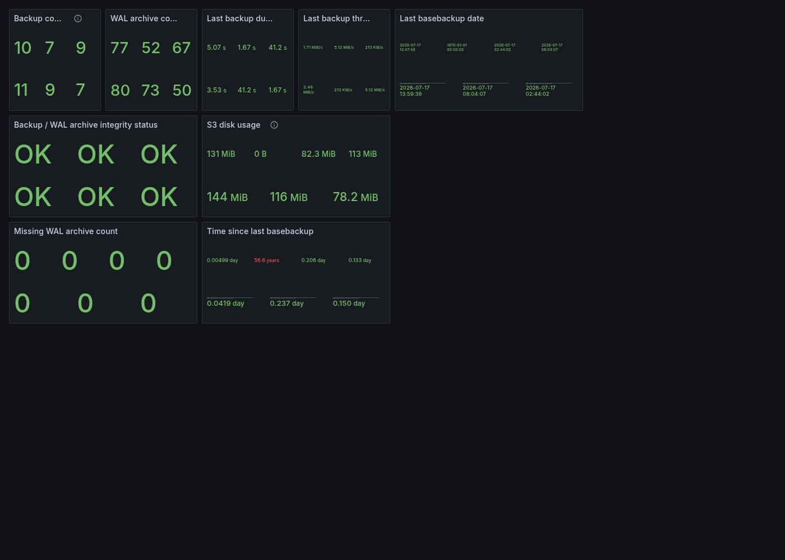

# Мониторинг бэкапов WAL-G через wal-g-exporter

## Область применения

Инструкция описывает подключение [wal-g-exporter](https://github.com/thedatabaseme/wal-g-exporter) — Prometheus-экспортёра метрик WAL-G (количество base backup'ов, свежесть WAL-архива, целостность архива, размер бэкапов в S3) — к кластеру PostgreSQL под управлением Zalando postgres-operator.

Предполагается, что WAL-G уже настроен (см. [`docs/postgres-walg-backup-setup.md`](postgres-walg-backup-setup.md)) — экспортёр только читает существующий envdir и вызывает `wal-g` для получения статуса, сам архив не трогает.

## 1. Как это работает

`wal-g-exporter` умеет работать как sidecar-контейнер внутри пода Spilo и знает о роли инстанса (primary/replica) через прямой SQL-запрос `SELECT NOT pg_is_in_recovery()`:
- на **primary** — реально собирает и отдаёт метрики (`wal-g backup-list`, `wal-g wal-verify` и т.п.);
- на **replica** — не собирает метрики вообще (только пишет в лог `Running on replica, waiting for promotion...`), чтобы при скрейпе со всех подов кластера метрики не суммировались/не дублировались.

Как и `wal-g`, экспортёр ожидает переменные окружения WAL-G в виде envdir-файлов в `/run/etc/wal-e.d/env` — это то же самое место, которое Spilo заполняет для самого `wal-g` (см. `pod_environment_secret` в [`postgres-walg-backup-setup.md`](postgres-walg-backup-setup.md)). Поскольку `/run/etc/wal-e.d/env` — это директория внутри контейнера `postgres`, а не отдельный volume, для sidecar'а её нужно сделать общей через `additionalVolumes` (emptyDir, смонтированный в оба контейнера по пути `/run/etc`).

Подключение к Postgres для проверки роли — через unix-сокет (`PGHOST=/var/run/postgresql`), который в кластере уже общий для всех контейнеров пода (volume `socket-directory`, targetContainers: `all`). `pg_hba.conf` у Spilo по умолчанию разрешает `local all all trust`, поэтому пароль не нужен — в отличие от примера в README апстрима, который подключается по TCP с credentials из отдельного Postgres-пользователя.

> **Важно (грабли): образ в README апстрима указан неверно.** Там фигурирует `ghcr.io/thedatabaseme/wal-g-prometheus-exporter:latest` — этого образа не существует (`ghcr.io` отвечает `403 DENIED` на попытку получить токен, то есть пакета с таким именем просто нет). Реальное имя образа, которое публикует CI проекта (`.github/workflows/build.yml`, `docker/metadata-action` → `images: ghcr.io/thedatabaseme/wal-g-exporter`) — **`ghcr.io/thedatabaseme/wal-g-exporter:latest`**.

## 2. Sidecar в values чарта

`charts/postgres-cluster/values-step7-walg-exporter.yaml` добавляет sidecar `walg-exporter` (шаблон `templates/postgresql.yaml` рендерит его условно — только если `sidecars.walgExporter` задан в values, см. `{{- if .Values.sidecars.walgExporter }}`):

```yaml
sidecars:
  walgExporter:
    image: ghcr.io/thedatabaseme/wal-g-exporter:latest
    resources:
      requests:
        cpu: 10m
        memory: 32Mi
      limits:
        cpu: 100m
        memory: 128Mi
```

Эквивалент того, что в итоге уходит оператору (sidecar-контейнер + общий с `postgres` volume `walg`):

```yaml
sidecars:
  - name: walg-exporter
    image: ghcr.io/thedatabaseme/wal-g-exporter:latest
    ports:
      - name: walg-exporter
        containerPort: 9351
        protocol: TCP
    env:
      - name: PGHOST
        value: /var/run/postgresql
      - name: PGUSER
        value: postgres
additionalVolumes:
  - name: walg
    mountPath: /run/etc
    targetContainers:
      - postgres
      - walg-exporter
    volumeSource:
      emptyDir: {}
```

`PGSSLMODE` не переопределяется — для unix-socket подключений SSL/`sslmode` игнорируется PostgreSQL в принципе, ошибки не возникает даже с дефолтным `require`.

Применяем — это последний файл в цепочке `values-step*.yaml`, перечисляем все:

```bash
helm upgrade postgres-cluster ./charts/postgres-cluster \
  --namespace postgres \
  --values charts/postgres-cluster/values.yaml \
  --values charts/postgres-cluster/values-step3-walg.yaml \
  --values charts/postgres-cluster/values-step4-v18.yaml \
  --values charts/postgres-cluster/values-step6-partman.yaml \
  --values charts/postgres-cluster/values-step7-walg-exporter.yaml
```

Оператор обновит StatefulSet и последовательно пересоздаст поды кластера с новым sidecar-контейнером (`3/3 Running`).

## 3. Service и VMServiceScrape

Порт `9351` уже присутствует в headless Service и в `VMServiceScrape` чарта `postgres-cluster` безусловно (`templates/service-metrics.yaml`/`templates/vmservicescrape.yaml`, те же ресурсы, что уже используются для `pg-exporter`/`patroni`, см. [`postgres-cluster-deployment-with-monitoring.md`](postgres-cluster-deployment-with-monitoring.md)) — ничего дополнительно применять не нужно, `helm upgrade` из раздела 2 выше уже их обновил:

```yaml
ports:
  - name: walg-exporter
    port: 9351
    targetPort: 9351
```

```yaml
endpoints:
  - port: walg-exporter
    interval: 30s
```

## 4. Дашборд в Grafana

Апстрим поставляет готовый дашборд (`grafana/dashboard.json`), сохранён в репозитории как `charts/monitoring-extras/dashboards/postgresql-walg.json`. Деплоится так же, как и остальные дашборды — ConfigMap с лейблом `grafana_dashboard=1`, генерируется автоматически чартом `monitoring-extras` (см. [`postgres-cluster-deployment-with-monitoring.md`, Шаг 5](postgres-cluster-deployment-with-monitoring.md)). Если релиз `monitoring-extras` уже установлен — этот дашборд в нём уже есть, ничего дополнительно применять не нужно.



> **Грабли (исправлено в этом репозитории):** апстримный JSON содержал сразу три независимых бага, из-за которых все панели показывали «No data» сразу после первого деплоя:
> 1. Переменная `namespace` имела `"allValue": "blank = nothing"` — буквальное значение (а не служебный плейсхолдер), которое Grafana подставляет вместо `$namespace` при дефолтном выборе `All`. Запросы превращались в `namespace=~"blank = nothing"` и не матчились никогда.
> 2. Переменная `datasource` (тип `datasource`) была захардкожена на `current.value = "prometheus"` — это не UID реального датасорса, а общий идентификатор типа плагина из апстримного экспорта.
> 3. Переменная `instance` была `multi: false` с захардкоженным `current` на несуществующий хост апстрима (`postgres-homelab-backup-exporter...`), и все панели фильтровали через точное равенство `instance='$instance'`.
>
> Исправлено: `allValue` очищен (пустая строка), `datasource` указывает на реальный датасорс `VictoriaMetrics` (единственный VictoriaMetrics-датасорс, который этот стенд вообще разворачивает — см. `monitoring/vm-values.yaml`), `instance` переведён на `multi: true` + `includeAll: true` с дефолтом `All` (аналогично `namespace`), панели — на `instance=~"$instance"` (regex-match). Как и `namespace`, инстанс всегда резолвится в единственное значение (метрики отдаёт только текущий Leader — см. раздел 1), поэтому `All` по регэкспу эквивалентен точному совпадению, но не привязан к конкретному под-IP, который меняется при каждом передеплое.

## 5. Метрики

| Метрика | Описание |
|---|---|
| `walg_basebackup_count` | Число base backup'ов в S3 |
| `walg_oldest_basebackup` / `walg_newest_basebackup` | Таймстемпы самого старого/свежего base backup'а |
| `walg_last_basebackup_duration` | Длительность последнего base backup'а, сек |
| `walg_last_basebackup_throughput_bytes` | Throughput последнего base backup'а, байт/сек |
| `walg_wal_archive_count` | Число заархивированных WAL-сегментов в S3 |
| `walg_wal_archive_missing_count` | Число отсутствующих WAL-сегментов (>0 только при `walg_wal_integrity_status{status="FAILURE"} == 1`) |
| `walg_wal_integrity_status{status}` | `1`/`0` — статус целостности WAL-архива (`OK`/`FAILURE`) |
| `walg_last_upload{type="basebackup"\|"wal"}` | Таймстемп последней загрузки в S3 по типу |
| `walg_s3_diskusage` | Суммарный размер бэкапов/архива в S3, байт |

Полезные алерт-кандидаты: `time() - walg_last_upload{type="wal"} > 300` (WAL не архивировался N минут — сломан `archive_command`), `walg_wal_integrity_status{status="FAILURE"} == 1`, `time() - walg_newest_basebackup > 90000` (base backup не снимался дольше суток при суточном `BACKUP_SCHEDULE`).

## 6. Проверка

```bash
# Все поды кластера 3/3 (postgres + prometheus-postgres-exporter + walg-exporter)
kubectl get pods -n postgres -l cluster-name=postgres-cluster

# Метрики отдаются на primary (на replica будет пусто - экспортёр там не собирает метрики)
kubectl exec -n postgres <primary-pod> -c postgres -- curl -s http://localhost:9351/metrics | grep ^walg_

# Лог должен показывать роль и цикл сбора
kubectl logs -n postgres <primary-pod> -c walg-exporter --tail=20

# VMAgent видит все 3 таргета up
kubectl port-forward -n monitoring svc/vmagent-vm-victoria-metrics-k8s-stack 8429:8429
# → http://localhost:8429/targets, искать endpoint=walg-exporter
```
